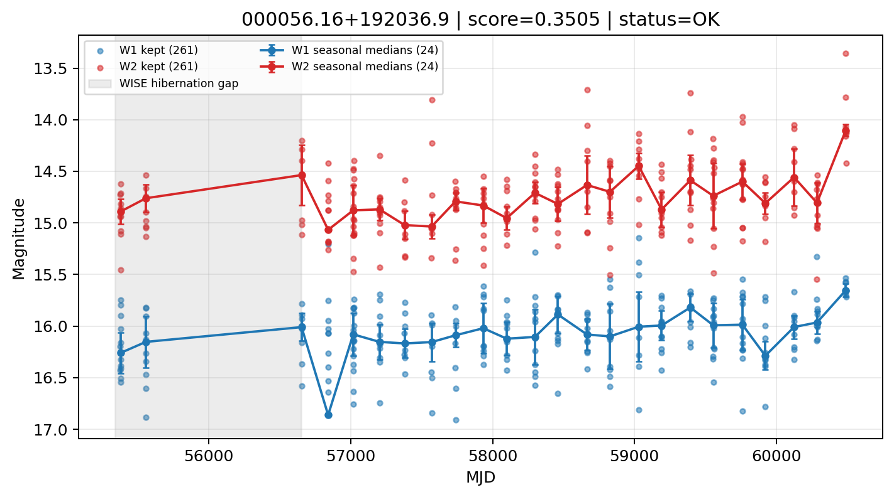

# Candidate Card: 000056.16+192036.9 (Rank 106)

## Basic Metadata

- `source_id`: `000056.16+192036.9`
- `canonical_id`: `000056.16+192036.9`
- `score`: `0.350474`
- `status`: `OK`
- `final_label`: `Known AGN`
- `stage_a_positive`: `True`
- `gate_blazar_veto`: `True`
- `gate_wise_qc_pass`: `True`
- `gate_data_sufficient`: `True`
- `decision_trace`: `stage_a_positive=pass;gate_blazar_veto=pass;gate_wise_qc_pass=pass;gate_data_sufficient=pass;gate_state_change_ratio_pass=pass;gate_transient_spike_pass=pass`

## Sampling / Variability Summary

- `n_points` (results table): `153.0`
- `baseline_days`: `5115.93`
- `baseline_years`: `14.007`
- `band_coverage`: `W1,W2`
- `delta_mag`: `0.405`
- `delta_mag_method`: `seasonal_median_flux`

## Coordinates

- `ra`: `0.234034`
- `dec`: `19.343593`
- `coordinate_source`: `benchmark_master`

## WISE Light Curve

## WISE QA / Rejection Accounting

| Metric | Value |
| --- | --- |
| Raw points total | 522 |
| Raw points W1 | 261 |
| Raw points W2 | 261 |
| Kept points total | 522 |
| Kept points W1 | 261 |
| Kept points W2 | 261 |
| Fraction rejected | 0 |
| Reject: missing time | 0 |
| Reject: missing mag | 0 |
| Reject: invalid band | 0 |
| Reject: cc_flags | 0 |
| Reject: qual_frame | 0 |
| Reject: moon_lev | 0 |

### QA Reject Reason Counts

| reject_reason | count |
| --- | --- |
| reject_cc_flags | 0 |
| reject_invalid_band | 0 |
| reject_missing_mag | 0 |
| reject_missing_time | 0 |
| reject_moon_lev | 0 |
| reject_qual_frame | 0 |

## Flag Summary

### `cc_flags`

| value | count | fraction |
| --- | --- | --- |
| 0000 | 522 | 1 |

### `qual_frame`

| value | count | fraction |
| --- | --- | --- |
| <NA> | 522 | 1 |

### `moon_lev`

| value | count | fraction |
| --- | --- | --- |
| 00 | 452 | 0.8659 |
| 0000 | 46 | 0.0881226 |
| 01 | 16 | 0.0306513 |
| 11 | 8 | 0.0153257 |

### `qi_fact`

| value | count | fraction |
| --- | --- | --- |
| 1.0 | 430 | 0.823755 |
| 0.5 | 86 | 0.164751 |
| 0.0 | 6 | 0.0114943 |

### `saa_sep`

| value | count | fraction |
| --- | --- | --- |
| 28.0 | 6 | 0.0114943 |
| 38.0 | 6 | 0.0114943 |
| 88.0 | 4 | 0.00766284 |
| 118.48899841308594 | 4 | 0.00766284 |
| 55.0 | 4 | 0.00766284 |
| 49.428001403808594 | 2 | 0.00383142 |
| 80.87300109863281 | 2 | 0.00383142 |
| 42.90999984741211 | 2 | 0.00383142 |

### `ph_qual`

| value | count | fraction |
| --- | --- | --- |
| BU | 134 | 0.256705 |
| BC | 124 | 0.237548 |
| BB | 122 | 0.233716 |
| <NA> | 46 | 0.0881226 |
| CB | 32 | 0.0613027 |
| CU | 22 | 0.0421456 |
| CC | 20 | 0.0383142 |
| UB | 12 | 0.0229885 |

## Coverage Summary

- Seasonal bins (W1): `24`
- Seasonal bins (W2): `24`
- Pre-gap coverage: `False`
- Post-gap coverage: `True`
- Both-sides coverage: `False`

## Systematics Verdict

- Verdict: `CAUTION`
- Summary: Variability signal is present but data quality/coverage limitations weaken confidence.
- QA-dominated signal check: Not obviously dominated by flagged/low-quality points

Reasons:
- No clean coverage on both sides of WISE hibernation gap

## Catalog Checks

- Known blazar match: `NO`
- Known CLAGN match: `NO`
- Gaia metrics: not provided / no match

## Final Label

**Known AGN**

- Rank 106 with score=0.3505
- Sampling: n_points=153.0, baseline_years=14.0066499211, band_coverage=W1,W2
- QA rejection fraction=0.0% (main causes summarized in card QA section)
- Systematics verdict=CAUTION: Variability signal is present but data quality/coverage limitations weaken confidence.
- Known blazar catalog match=NO
- Dataset metadata class=normal_agn

## Reproducibility

- `run_timestamp_utc`: `2026-03-02T06:47:01.885248+00:00`
- `results_file`: `data/real_clagn/benchmark_scores_v2.csv`
- `wise_file`: `data/wise/000056.16+192036.9.csv`
- `score_threshold`: `0.0`
- `t_recall`: `0.3493918746`
