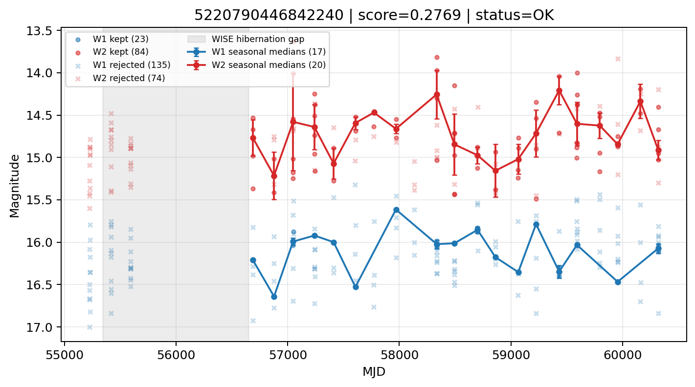

# Candidate Card: 5220790446842240 (Rank 121)

## Basic Metadata

- `source_id`: `5220790446842240`
- `canonical_id`: `5220790446842240`
- `score`: `0.276877`
- `status`: `OK`
- `final_label`: `Rejected`
- `stage_a_positive`: `False`
- `gate_blazar_veto`: `True`
- `gate_wise_qc_pass`: `True`
- `gate_data_sufficient`: `True`
- `decision_trace`: `stage_a_positive=fail;gate_blazar_veto=pass;gate_wise_qc_pass=pass;gate_data_sufficient=pass;gate_state_change_ratio_pass=pass;gate_transient_spike_pass=pass`

## Sampling / Variability Summary

- `n_points` (results table): `33.0`
- `baseline_days`: `3273.16`
- `baseline_years`: `8.961`
- `band_coverage`: `W1,W2`
- `delta_mag`: `0.248`
- `delta_mag_method`: `seasonal_median_flux`

## Coordinates

- `ra`: `44.376093`
- `dec`: `4.448312`
- `coordinate_source`: `benchmark_master`

## WISE Light Curve

## WISE QA / Rejection Accounting

| Metric | Value |
| --- | --- |
| Raw points total | 316 |
| Raw points W1 | 158 |
| Raw points W2 | 158 |
| Kept points total | 107 |
| Kept points W1 | 23 |
| Kept points W2 | 84 |
| Fraction rejected | 0.661392 |
| Reject: missing time | 0 |
| Reject: missing mag | 0 |
| Reject: invalid band | 0 |
| Reject: cc_flags | 209 |
| Reject: qual_frame | 0 |
| Reject: moon_lev | 0 |

### QA Reject Reason Counts

| reject_reason | count |
| --- | --- |
| reject_cc_flags | 209 |
| reject_invalid_band | 0 |
| reject_missing_mag | 0 |
| reject_missing_time | 0 |
| reject_moon_lev | 0 |
| reject_qual_frame | 0 |

## Flag Summary

### `cc_flags`

| value | count | fraction |
| --- | --- | --- |
| H000 | 100 | 0.316456 |
| DDd0 | 68 | 0.21519 |
| DD00 | 54 | 0.170886 |
| 0000 | 46 | 0.14557 |
| HD00 | 26 | 0.0822785 |
| D000 | 20 | 0.0632911 |
| g000 | 2 | 0.00632911 |

### `qual_frame`

| value | count | fraction |
| --- | --- | --- |
| <NA> | 316 | 1 |

### `moon_lev`

| value | count | fraction |
| --- | --- | --- |
| 00 | 206 | 0.651899 |
| 0000 | 68 | 0.21519 |
| 11 | 26 | 0.0822785 |
| 01 | 16 | 0.0506329 |

### `qi_fact`

| value | count | fraction |
| --- | --- | --- |
| 1.0 | 220 | 0.696203 |
| 0.5 | 96 | 0.303797 |

### `saa_sep`

| value | count | fraction |
| --- | --- | --- |
| 111.0 | 4 | 0.0126582 |
| 32.0 | 4 | 0.0126582 |
| 51.0 | 4 | 0.0126582 |
| 94.0 | 4 | 0.0126582 |
| 33.0 | 4 | 0.0126582 |
| 97.0 | 4 | 0.0126582 |
| 68.0 | 2 | 0.00632911 |
| 110.42900085449219 | 2 | 0.00632911 |

### `ph_qual`

| value | count | fraction |
| --- | --- | --- |
| BU | 104 | 0.329114 |
| <NA> | 68 | 0.21519 |
| BC | 48 | 0.151899 |
| CU | 24 | 0.0759494 |
| CC | 20 | 0.0632911 |
| UB | 16 | 0.0506329 |
| BB | 16 | 0.0506329 |
| UC | 8 | 0.0253165 |

## Coverage Summary

- Seasonal bins (W1): `17`
- Seasonal bins (W2): `20`
- Pre-gap coverage: `False`
- Post-gap coverage: `True`
- Both-sides coverage: `False`

## Systematics Verdict

- Verdict: `CAUTION`
- Summary: Variability signal is present but data quality/coverage limitations weaken confidence.
- QA-dominated signal check: Not obviously dominated by flagged/low-quality points

Reasons:
- High QA rejection fraction (66.1%)
- No clean coverage on both sides of WISE hibernation gap

## Catalog Checks

- Known blazar match: `NO`
- Known CLAGN match: `NO`
- Gaia metrics: not provided / no match

## Final Label

**Rejected**

- Rank 121 with score=0.2769
- Sampling: n_points=33.0, baseline_years=8.9614259754, band_coverage=W1,W2
- QA rejection fraction=66.1% (main causes summarized in card QA section)
- Systematics verdict=CAUTION: Variability signal is present but data quality/coverage limitations weaken confidence.
- Known blazar catalog match=NO
- Dataset metadata class=star

## Reproducibility

- `run_timestamp_utc`: `2026-03-02T06:47:01.885248+00:00`
- `results_file`: `data/real_clagn/benchmark_scores_v2.csv`
- `wise_file`: `data/wise/5220790446842240.csv`
- `score_threshold`: `0.0`
- `t_recall`: `0.3493918746`
