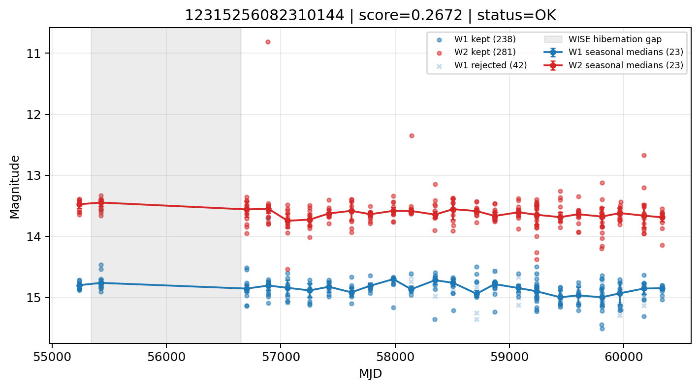

# Candidate Card: 12315256082310144 (Rank 127)

## Basic Metadata

- `source_id`: `12315256082310144`
- `canonical_id`: `12315256082310144`
- `score`: `0.267233`
- `status`: `OK`
- `final_label`: `Rejected`
- `stage_a_positive`: `False`
- `gate_blazar_veto`: `True`
- `gate_wise_qc_pass`: `True`
- `gate_data_sufficient`: `True`
- `decision_trace`: `stage_a_positive=fail;gate_blazar_veto=pass;gate_wise_qc_pass=pass;gate_data_sufficient=pass;gate_state_change_ratio_pass=pass;gate_transient_spike_pass=pass`

## Sampling / Variability Summary

- `n_points` (results table): `92.0`
- `baseline_days`: `5098.88`
- `baseline_years`: `13.960`
- `band_coverage`: `W1,W2`
- `delta_mag`: `-0.163`
- `delta_mag_method`: `seasonal_median_flux`

## Coordinates

- `ra`: `54.574408`
- `dec`: `9.969912`
- `coordinate_source`: `benchmark_master`

## WISE Light Curve

## WISE QA / Rejection Accounting

| Metric | Value |
| --- | --- |
| Raw points total | 562 |
| Raw points W1 | 281 |
| Raw points W2 | 281 |
| Kept points total | 519 |
| Kept points W1 | 238 |
| Kept points W2 | 281 |
| Fraction rejected | 0.0765125 |
| Reject: missing time | 0 |
| Reject: missing mag | 1 |
| Reject: invalid band | 0 |
| Reject: cc_flags | 42 |
| Reject: qual_frame | 0 |
| Reject: moon_lev | 0 |

### QA Reject Reason Counts

| reject_reason | count |
| --- | --- |
| reject_cc_flags | 42 |
| reject_invalid_band | 0 |
| reject_missing_mag | 1 |
| reject_missing_time | 0 |
| reject_moon_lev | 0 |
| reject_qual_frame | 0 |

## Flag Summary

### `cc_flags`

| value | count | fraction |
| --- | --- | --- |
| 0000 | 478 | 0.850534 |
| H000 | 82 | 0.145907 |
| h000 | 2 | 0.00355872 |

### `qual_frame`

| value | count | fraction |
| --- | --- | --- |
| <NA> | 562 | 1 |

### `moon_lev`

| value | count | fraction |
| --- | --- | --- |
| 00 | 448 | 0.797153 |
| 0000 | 50 | 0.088968 |
| 11 | 48 | 0.0854093 |
| 01 | 16 | 0.0284698 |

### `qi_fact`

| value | count | fraction |
| --- | --- | --- |
| 0.5 | 292 | 0.519573 |
| 1.0 | 246 | 0.437722 |
| 0.0 | 24 | 0.0427046 |

### `saa_sep`

| value | count | fraction |
| --- | --- | --- |
| 121.0 | 4 | 0.00711744 |
| 21.0 | 4 | 0.00711744 |
| 94.0 | 4 | 0.00711744 |
| 117.83499908447266 | 2 | 0.00355872 |
| 28.143999099731445 | 2 | 0.00355872 |
| 47.470001220703125 | 2 | 0.00355872 |
| 71.87799835205078 | 2 | 0.00355872 |
| 92.24400329589844 | 2 | 0.00355872 |

### `ph_qual`

| value | count | fraction |
| --- | --- | --- |
| AB | 230 | 0.409253 |
| BB | 168 | 0.298932 |
| AA | 72 | 0.128114 |
| <NA> | 50 | 0.088968 |
| BA | 24 | 0.0427046 |
| BC | 8 | 0.0142349 |
| UB | 2 | 0.00355872 |
| BU | 2 | 0.00355872 |

## Coverage Summary

- Seasonal bins (W1): `23`
- Seasonal bins (W2): `23`
- Pre-gap coverage: `True`
- Post-gap coverage: `True`
- Both-sides coverage: `True`

## Systematics Verdict

- Verdict: `PASS`
- Summary: QA-clean points and seasonal coverage support the observed variability signal.
- QA-dominated signal check: Not obviously dominated by flagged/low-quality points

Reasons:
- Seasonal trend supported by sufficient QA-clean W1/W2 points

## Catalog Checks

- Known blazar match: `NO`
- Known CLAGN match: `NO`
- Gaia metrics: not provided / no match

## Final Label

**Rejected**

- Rank 127 with score=0.2672
- Sampling: n_points=92.0, baseline_years=13.9599682438, band_coverage=W1,W2
- QA rejection fraction=7.7% (main causes summarized in card QA section)
- Systematics verdict=PASS: QA-clean points and seasonal coverage support the observed variability signal.
- Known blazar catalog match=NO
- Dataset metadata class=star

## Reproducibility

- `run_timestamp_utc`: `2026-03-02T06:47:01.885248+00:00`
- `results_file`: `data/real_clagn/benchmark_scores_v2.csv`
- `wise_file`: `data/wise/12315256082310144.csv`
- `score_threshold`: `0.0`
- `t_recall`: `0.3493918746`
