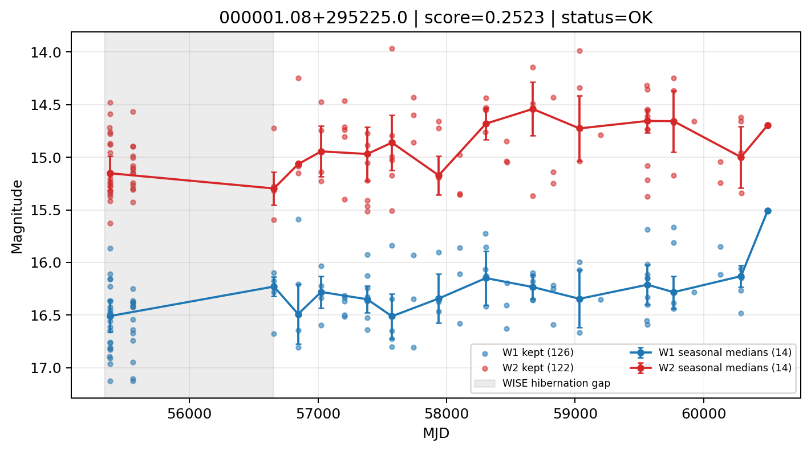

# Candidate Card: 000001.08+295225.0 (Rank 134)

## Basic Metadata

- `source_id`: `000001.08+295225.0`
- `canonical_id`: `000001.08+295225.0`
- `score`: `0.252270`
- `status`: `OK`
- `final_label`: `Rejected`
- `stage_a_positive`: `False`
- `gate_blazar_veto`: `True`
- `gate_wise_qc_pass`: `True`
- `gate_data_sufficient`: `True`
- `decision_trace`: `stage_a_positive=fail;gate_blazar_veto=pass;gate_wise_qc_pass=pass;gate_data_sufficient=pass;gate_state_change_ratio_pass=pass;gate_transient_spike_pass=pass`

## Sampling / Variability Summary

- `n_points` (results table): `50.0`
- `baseline_days`: `4910.91`
- `baseline_years`: `13.445`
- `band_coverage`: `W1,W2`
- `delta_mag`: `0.242`
- `delta_mag_method`: `seasonal_median_flux`

## Coordinates

- `ra`: `0.004528`
- `dec`: `29.873618`
- `coordinate_source`: `benchmark_master`

## WISE Light Curve

## WISE QA / Rejection Accounting

| Metric | Value |
| --- | --- |
| Raw points total | 252 |
| Raw points W1 | 126 |
| Raw points W2 | 126 |
| Kept points total | 248 |
| Kept points W1 | 126 |
| Kept points W2 | 122 |
| Fraction rejected | 0.015873 |
| Reject: missing time | 0 |
| Reject: missing mag | 4 |
| Reject: invalid band | 0 |
| Reject: cc_flags | 0 |
| Reject: qual_frame | 0 |
| Reject: moon_lev | 0 |

### QA Reject Reason Counts

| reject_reason | count |
| --- | --- |
| reject_cc_flags | 0 |
| reject_invalid_band | 0 |
| reject_missing_mag | 4 |
| reject_missing_time | 0 |
| reject_moon_lev | 0 |
| reject_qual_frame | 0 |

## Flag Summary

### `cc_flags`

| value | count | fraction |
| --- | --- | --- |
| 0000 | 252 | 1 |

### `qual_frame`

| value | count | fraction |
| --- | --- | --- |
| <NA> | 252 | 1 |

### `moon_lev`

| value | count | fraction |
| --- | --- | --- |
| 00 | 172 | 0.68254 |
| 0000 | 46 | 0.18254 |
| 0011 | 26 | 0.103175 |
| 0111 | 8 | 0.031746 |

### `qi_fact`

| value | count | fraction |
| --- | --- | --- |
| 1.0 | 208 | 0.825397 |
| 0.5 | 34 | 0.134921 |
| 0.0 | 10 | 0.0396825 |

### `saa_sep`

| value | count | fraction |
| --- | --- | --- |
| 58.0 | 4 | 0.015873 |
| 35.0 | 4 | 0.015873 |
| 62.0 | 4 | 0.015873 |
| 120.0 | 4 | 0.015873 |
| 40.0 | 4 | 0.015873 |
| 65.0 | 4 | 0.015873 |
| 42.0 | 4 | 0.015873 |
| 45.98400115966797 | 2 | 0.00793651 |

### `ph_qual`

| value | count | fraction |
| --- | --- | --- |
| <NA> | 80 | 0.31746 |
| BU | 46 | 0.18254 |
| BC | 34 | 0.134921 |
| CU | 26 | 0.103175 |
| BB | 20 | 0.0793651 |
| CC | 16 | 0.0634921 |
| UC | 14 | 0.0555556 |
| UU | 8 | 0.031746 |

## Coverage Summary

- Seasonal bins (W1): `14`
- Seasonal bins (W2): `14`
- Pre-gap coverage: `False`
- Post-gap coverage: `True`
- Both-sides coverage: `False`

## Systematics Verdict

- Verdict: `CAUTION`
- Summary: Variability signal is present but data quality/coverage limitations weaken confidence.
- QA-dominated signal check: Not obviously dominated by flagged/low-quality points

Reasons:
- No clean coverage on both sides of WISE hibernation gap

## Catalog Checks

- Known blazar match: `NO`
- Known CLAGN match: `NO`
- Gaia metrics: not provided / no match

## Final Label

**Rejected**

- Rank 134 with score=0.2523
- Sampling: n_points=50.0, baseline_years=13.4453478132, band_coverage=W1,W2
- QA rejection fraction=1.6% (main causes summarized in card QA section)
- Systematics verdict=CAUTION: Variability signal is present but data quality/coverage limitations weaken confidence.
- Known blazar catalog match=NO
- Dataset metadata class=normal_agn

## Reproducibility

- `run_timestamp_utc`: `2026-03-02T06:47:01.885248+00:00`
- `results_file`: `data/real_clagn/benchmark_scores_v2.csv`
- `wise_file`: `data/wise/000001.08+295225.0.csv`
- `score_threshold`: `0.0`
- `t_recall`: `0.3493918746`
