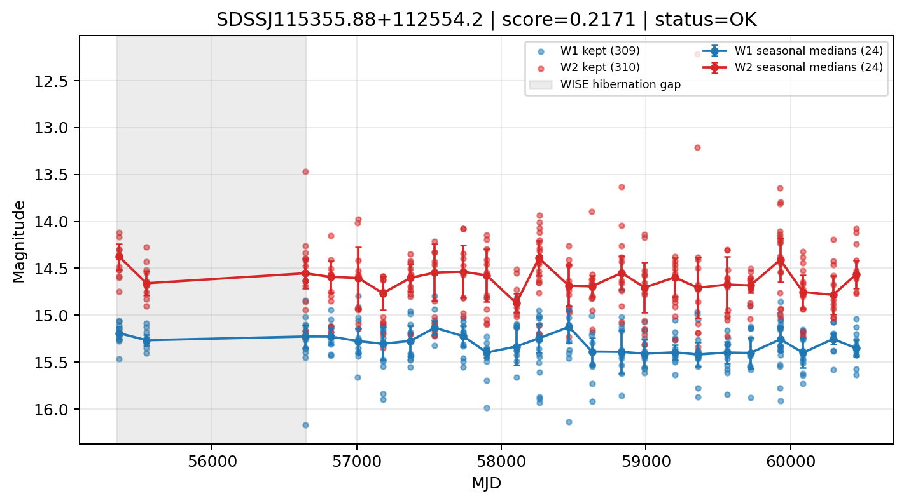

# Candidate Card: SDSSJ115355.88+112554.2 (Rank 147)

## Basic Metadata

- `source_id`: `SDSSJ115355.88+112554.2`
- `canonical_id`: `SDSSJ115355.88+112554.2`
- `score`: `0.217091`
- `status`: `OK`
- `final_label`: `Rejected`
- `stage_a_positive`: `False`
- `gate_blazar_veto`: `True`
- `gate_wise_qc_pass`: `True`
- `gate_data_sufficient`: `True`
- `decision_trace`: `stage_a_positive=fail;gate_blazar_veto=pass;gate_wise_qc_pass=pass;gate_data_sufficient=pass;gate_state_change_ratio_pass=pass;gate_transient_spike_pass=pass`

## Sampling / Variability Summary

- `n_points` (results table): `183.0`
- `baseline_days`: `5098.17`
- `baseline_years`: `13.958`
- `band_coverage`: `W1,W2`
- `delta_mag`: `-0.041`
- `delta_mag_method`: `seasonal_median_flux`

## Coordinates

- `ra`: `178.482860`
- `dec`: `11.431710`
- `coordinate_source`: `benchmark_master`

## WISE Light Curve

## WISE QA / Rejection Accounting

| Metric | Value |
| --- | --- |
| Raw points total | 620 |
| Raw points W1 | 310 |
| Raw points W2 | 310 |
| Kept points total | 619 |
| Kept points W1 | 309 |
| Kept points W2 | 310 |
| Fraction rejected | 0.0016129 |
| Reject: missing time | 0 |
| Reject: missing mag | 1 |
| Reject: invalid band | 0 |
| Reject: cc_flags | 0 |
| Reject: qual_frame | 0 |
| Reject: moon_lev | 0 |

### QA Reject Reason Counts

| reject_reason | count |
| --- | --- |
| reject_cc_flags | 0 |
| reject_invalid_band | 0 |
| reject_missing_mag | 1 |
| reject_missing_time | 0 |
| reject_moon_lev | 0 |
| reject_qual_frame | 0 |

## Flag Summary

### `cc_flags`

| value | count | fraction |
| --- | --- | --- |
| 0000 | 620 | 1 |

### `qual_frame`

| value | count | fraction |
| --- | --- | --- |
| <NA> | 620 | 1 |

### `moon_lev`

| value | count | fraction |
| --- | --- | --- |
| 00 | 500 | 0.806452 |
| 0000 | 46 | 0.0741935 |
| 11 | 40 | 0.0645161 |
| 01 | 34 | 0.0548387 |

### `qi_fact`

| value | count | fraction |
| --- | --- | --- |
| 1.0 | 436 | 0.703226 |
| 0.5 | 176 | 0.283871 |
| 0.0 | 8 | 0.0129032 |

### `saa_sep`

| value | count | fraction |
| --- | --- | --- |
| 43.0 | 6 | 0.00967742 |
| 23.0 | 4 | 0.00645161 |
| 29.408000946044922 | 4 | 0.00645161 |
| 117.05899810791016 | 2 | 0.00322581 |
| 55.56999969482422 | 2 | 0.00322581 |
| 82.63500213623047 | 2 | 0.00322581 |
| 117.89099884033203 | 2 | 0.00322581 |
| 16.716999053955078 | 2 | 0.00322581 |

### `ph_qual`

| value | count | fraction |
| --- | --- | --- |
| BB | 250 | 0.403226 |
| BC | 158 | 0.254839 |
| BU | 104 | 0.167742 |
| <NA> | 46 | 0.0741935 |
| AB | 34 | 0.0548387 |
| AC | 12 | 0.0193548 |
| AU | 10 | 0.016129 |
| CU | 4 | 0.00645161 |

## Coverage Summary

- Seasonal bins (W1): `24`
- Seasonal bins (W2): `24`
- Pre-gap coverage: `False`
- Post-gap coverage: `True`
- Both-sides coverage: `False`

## Systematics Verdict

- Verdict: `CAUTION`
- Summary: Variability signal is present but data quality/coverage limitations weaken confidence.
- QA-dominated signal check: Not obviously dominated by flagged/low-quality points

Reasons:
- No clean coverage on both sides of WISE hibernation gap

## Catalog Checks

- Known blazar match: `NO`
- Known CLAGN match: `NO`
- Gaia metrics: not provided / no match

## Final Label

**Rejected**

- Rank 147 with score=0.2171
- Sampling: n_points=183.0, baseline_years=13.958015304, band_coverage=W1,W2
- QA rejection fraction=0.2% (main causes summarized in card QA section)
- Systematics verdict=CAUTION: Variability signal is present but data quality/coverage limitations weaken confidence.
- Known blazar catalog match=NO
- Dataset metadata class=clagn

## Reproducibility

- `run_timestamp_utc`: `2026-03-02T06:47:01.885248+00:00`
- `results_file`: `data/real_clagn/benchmark_scores_v2.csv`
- `wise_file`: `data/wise/SDSSJ115355.88+112554.2.csv`
- `score_threshold`: `0.0`
- `t_recall`: `0.3493918746`
