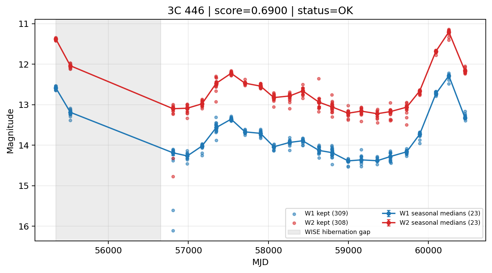

# Candidate Card: 3C 446 (Rank 15)

## Basic Metadata

- `source_id`: `3C 446`
- `canonical_id`: `3C 446`
- `score`: `0.689994`
- `status`: `OK`
- `final_label`: `Known blazar`
- `stage_a_positive`: `True`
- `gate_blazar_veto`: `False`
- `gate_wise_qc_pass`: `True`
- `gate_data_sufficient`: `True`
- `decision_trace`: `stage_a_positive=pass;gate_blazar_veto=fail;gate_wise_qc_pass=pass;gate_data_sufficient=pass;gate_state_change_ratio_pass=pass;gate_transient_spike_pass=pass`

## Sampling / Variability Summary

- `n_points` (results table): `202.0`
- `baseline_days`: `5113.96`
- `baseline_years`: `14.001`
- `band_coverage`: `W1,W2`
- `delta_mag`: `-0.126`
- `delta_mag_method`: `seasonal_median_flux`

## Coordinates

- `ra`: `336.446900`
- `dec`: `-4.950400`
- `coordinate_source`: `benchmark_master`

## WISE Light Curve

## WISE QA / Rejection Accounting

| Metric | Value |
| --- | --- |
| Raw points total | 618 |
| Raw points W1 | 309 |
| Raw points W2 | 309 |
| Kept points total | 617 |
| Kept points W1 | 309 |
| Kept points W2 | 308 |
| Fraction rejected | 0.00161812 |
| Reject: missing time | 0 |
| Reject: missing mag | 1 |
| Reject: invalid band | 0 |
| Reject: cc_flags | 0 |
| Reject: qual_frame | 0 |
| Reject: moon_lev | 0 |

### QA Reject Reason Counts

| reject_reason | count |
| --- | --- |
| reject_cc_flags | 0 |
| reject_invalid_band | 0 |
| reject_missing_mag | 1 |
| reject_missing_time | 0 |
| reject_moon_lev | 0 |
| reject_qual_frame | 0 |

## Flag Summary

### `cc_flags`

| value | count | fraction |
| --- | --- | --- |
| 0000 | 618 | 1 |

### `qual_frame`

| value | count | fraction |
| --- | --- | --- |
| <NA> | 618 | 1 |

### `moon_lev`

| value | count | fraction |
| --- | --- | --- |
| 00 | 494 | 0.799353 |
| 0000 | 80 | 0.12945 |
| 11 | 42 | 0.0679612 |
| 01 | 2 | 0.00323625 |

### `qi_fact`

| value | count | fraction |
| --- | --- | --- |
| 1.0 | 496 | 0.802589 |
| 0.5 | 96 | 0.15534 |
| 0.0 | 26 | 0.0420712 |

### `saa_sep`

| value | count | fraction |
| --- | --- | --- |
| 98.0 | 8 | 0.012945 |
| -1.0 | 8 | 0.012945 |
| 107.0 | 6 | 0.00970874 |
| 10.0 | 4 | 0.00647249 |
| 4.0 | 4 | 0.00647249 |
| 23.670000076293945 | 4 | 0.00647249 |
| 27.0 | 4 | 0.00647249 |
| 95.0 | 4 | 0.00647249 |

### `ph_qual`

| value | count | fraction |
| --- | --- | --- |
| AA | 468 | 0.757282 |
| <NA> | 80 | 0.12945 |
| AB | 62 | 0.100324 |
| BB | 4 | 0.00647249 |
| BC | 2 | 0.00323625 |
| AX | 2 | 0.00323625 |

## Coverage Summary

- Seasonal bins (W1): `23`
- Seasonal bins (W2): `23`
- Pre-gap coverage: `False`
- Post-gap coverage: `True`
- Both-sides coverage: `False`

## Systematics Verdict

- Verdict: `CAUTION`
- Summary: Variability signal is present but data quality/coverage limitations weaken confidence.
- QA-dominated signal check: Not obviously dominated by flagged/low-quality points

Reasons:
- No clean coverage on both sides of WISE hibernation gap

## Catalog Checks

- Known blazar match: `YES` via `source_id` token `3C 446`
- Known CLAGN match: `NO`
- Gaia metrics: not provided / no match

## Final Label

**Known blazar**

- Rank 15 with score=0.6900
- Sampling: n_points=202.0, baseline_years=14.0012640661, band_coverage=W1,W2
- QA rejection fraction=0.2% (main causes summarized in card QA section)
- Systematics verdict=CAUTION: Variability signal is present but data quality/coverage limitations weaken confidence.
- Known blazar catalog match=YES
- Dataset metadata class=blazar

## Reproducibility

- `run_timestamp_utc`: `2026-03-02T06:47:01.885248+00:00`
- `results_file`: `data/real_clagn/benchmark_scores_v2.csv`
- `wise_file`: `data/wise/3C 446.csv`
- `score_threshold`: `0.0`
- `t_recall`: `0.3493918746`
