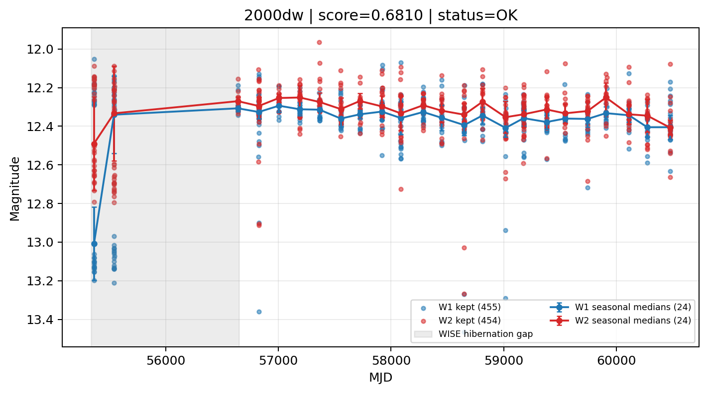

# Candidate Card: 2000dw (Rank 16)

## Basic Metadata

- `source_id`: `2000dw`
- `canonical_id`: `2000dw`
- `source_id_normalized`: `2000DW`
- `canonical_id_normalized`: `2000DW`
- `score`: `0.680989`
- `status`: `OK`
- `final_label`: `Rejected`
- `stage_a_positive`: `True`
- `gate_blazar_veto`: `True`
- `gate_wise_qc_pass`: `True`
- `gate_data_sufficient`: `True`
- `decision_trace`: `stage_a_positive=pass;gate_blazar_veto=pass;gate_wise_qc_pass=pass;gate_data_sufficient=pass;gate_state_change_ratio_pass=pass;gate_transient_spike_pass=pass`

## Sampling / Variability Summary

- `n_points` (results table): `202.0`
- `baseline_days`: `5114.34`
- `baseline_years`: `14.002`
- `band_coverage`: `W1,W2`
- `delta_mag`: `0.567`
- `delta_mag_method`: `seasonal_median_flux`

## Coordinates

- `ra`: `333.454417`
- `dec`: `39.237528`
- `coordinate_source`: `benchmark_master`

## WISE Light Curve

## WISE QA / Rejection Accounting

| Metric | Value |
| --- | --- |
| Raw points total | 910 |
| Raw points W1 | 455 |
| Raw points W2 | 455 |
| Kept points total | 909 |
| Kept points W1 | 455 |
| Kept points W2 | 454 |
| Fraction rejected | 0.0010989 |
| Reject: missing time | 0 |
| Reject: missing mag | 1 |
| Reject: invalid band | 0 |
| Reject: cc_flags | 0 |
| Reject: qual_frame | 0 |
| Reject: moon_lev | 0 |

### QA Reject Reason Counts

| reject_reason | count |
| --- | --- |
| reject_cc_flags | 0 |
| reject_invalid_band | 0 |
| reject_missing_mag | 1 |
| reject_missing_time | 0 |
| reject_moon_lev | 0 |
| reject_qual_frame | 0 |

## Flag Summary

### `cc_flags`

| value | count | fraction |
| --- | --- | --- |
| 0000 | 910 | 1 |

### `qual_frame`

| value | count | fraction |
| --- | --- | --- |
| <NA> | 910 | 1 |

### `moon_lev`

| value | count | fraction |
| --- | --- | --- |
| 00 | 782 | 0.859341 |
| 0000 | 128 | 0.140659 |

### `qi_fact`

| value | count | fraction |
| --- | --- | --- |
| 1.0 | 468 | 0.514286 |
| 0.5 | 308 | 0.338462 |
| 0.0 | 134 | 0.147253 |

### `saa_sep`

| value | count | fraction |
| --- | --- | --- |
| 48.0 | 12 | 0.0131868 |
| 72.0 | 8 | 0.00879121 |
| 130.0 | 8 | 0.00879121 |
| 65.0 | 8 | 0.00879121 |
| 132.0 | 8 | 0.00879121 |
| 54.0 | 8 | 0.00879121 |
| 94.0 | 8 | 0.00879121 |
| 73.0 | 8 | 0.00879121 |

### `ph_qual`

| value | count | fraction |
| --- | --- | --- |
| AA | 776 | 0.852747 |
| <NA> | 128 | 0.140659 |
| AX | 2 | 0.0021978 |
| AC | 2 | 0.0021978 |
| AB | 2 | 0.0021978 |

## Coverage Summary

- Seasonal bins (W1): `24`
- Seasonal bins (W2): `24`
- Pre-gap coverage: `False`
- Post-gap coverage: `True`
- Both-sides coverage: `False`

## Systematics Verdict

- Verdict: `CAUTION`
- Summary: Variability signal is present but data quality/coverage limitations weaken confidence.
- QA-dominated signal check: Not obviously dominated by flagged/low-quality points

Reasons:
- No clean coverage on both sides of WISE hibernation gap

## Catalog Checks

- Known blazar match: `NO`
- Known CLAGN match: `NO`
- Gaia metrics: not provided / no match

## Final Label

**Rejected**

- Rank 16 with score=0.6810
- Sampling: n_points=202.0, baseline_years=14.0023086939, band_coverage=W1,W2
- QA rejection fraction=0.1% (main causes summarized in card QA section)
- Systematics verdict=CAUTION: Variability signal is present but data quality/coverage limitations weaken confidence.
- Known blazar catalog match=NO
- Dataset metadata class=sn
- Rejected because dataset metadata class=sn is a known contaminant class

## Reproducibility

- `run_timestamp_utc`: `2026-03-02T06:47:01.885248+00:00`
- `results_file`: `data/real_clagn/benchmark_scores_v2.csv`
- `wise_file`: `data/wise/2000dw.csv`
- `score_threshold`: `0.0`
- `t_recall`: `0.3493918746`
