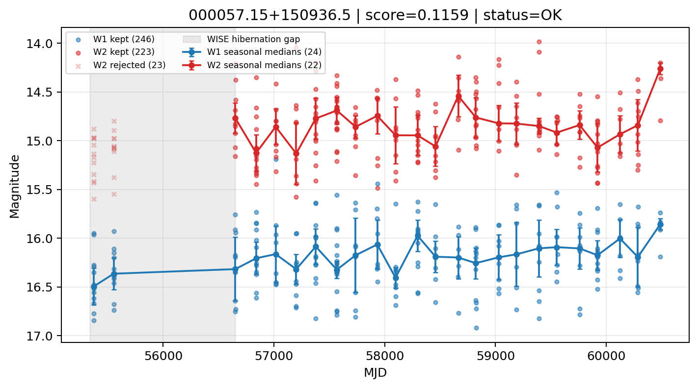

# Candidate Card: 000057.15+150936.5 (Rank 183)

## Basic Metadata

- `source_id`: `000057.15+150936.5`
- `canonical_id`: `000057.15+150936.5`
- `score`: `0.115892`
- `status`: `OK`
- `final_label`: `Rejected`
- `stage_a_positive`: `False`
- `gate_blazar_veto`: `True`
- `gate_wise_qc_pass`: `True`
- `gate_data_sufficient`: `True`
- `decision_trace`: `stage_a_positive=fail;gate_blazar_veto=pass;gate_wise_qc_pass=pass;gate_data_sufficient=pass;gate_state_change_ratio_pass=pass;gate_transient_spike_pass=pass`

## Sampling / Variability Summary

- `n_points` (results table): `85.0`
- `baseline_days`: `5112.74`
- `baseline_years`: `13.998`
- `band_coverage`: `W1,W2`
- `delta_mag`: `0.207`
- `delta_mag_method`: `seasonal_median_flux`

## Coordinates

- `ra`: `0.238158`
- `dec`: `15.160148`
- `coordinate_source`: `benchmark_master`

## WISE Light Curve

## WISE QA / Rejection Accounting

| Metric | Value |
| --- | --- |
| Raw points total | 492 |
| Raw points W1 | 246 |
| Raw points W2 | 246 |
| Kept points total | 469 |
| Kept points W1 | 246 |
| Kept points W2 | 223 |
| Fraction rejected | 0.046748 |
| Reject: missing time | 0 |
| Reject: missing mag | 0 |
| Reject: invalid band | 0 |
| Reject: cc_flags | 23 |
| Reject: qual_frame | 0 |
| Reject: moon_lev | 0 |

### QA Reject Reason Counts

| reject_reason | count |
| --- | --- |
| reject_cc_flags | 23 |
| reject_invalid_band | 0 |
| reject_missing_mag | 0 |
| reject_missing_time | 0 |
| reject_moon_lev | 0 |
| reject_qual_frame | 0 |

## Flag Summary

### `cc_flags`

| value | count | fraction |
| --- | --- | --- |
| 0000 | 446 | 0.906504 |
| 0h00 | 46 | 0.0934959 |

### `qual_frame`

| value | count | fraction |
| --- | --- | --- |
| <NA> | 492 | 1 |

### `moon_lev`

| value | count | fraction |
| --- | --- | --- |
| 00 | 410 | 0.833333 |
| 0000 | 46 | 0.0934959 |
| 11 | 20 | 0.0406504 |
| 01 | 16 | 0.0325203 |

### `qi_fact`

| value | count | fraction |
| --- | --- | --- |
| 1.0 | 354 | 0.719512 |
| 0.5 | 130 | 0.264228 |
| 0.0 | 8 | 0.0162602 |

### `saa_sep`

| value | count | fraction |
| --- | --- | --- |
| 65.0 | 6 | 0.0121951 |
| 51.244998931884766 | 4 | 0.00813008 |
| 22.0 | 4 | 0.00813008 |
| 55.04899978637695 | 2 | 0.00406504 |
| 40.43600082397461 | 2 | 0.00406504 |
| 37.547000885009766 | 2 | 0.00406504 |
| 33.89500045776367 | 2 | 0.00406504 |
| 94.33799743652344 | 2 | 0.00406504 |

### `ph_qual`

| value | count | fraction |
| --- | --- | --- |
| BU | 176 | 0.357724 |
| BC | 78 | 0.158537 |
| CU | 54 | 0.109756 |
| <NA> | 46 | 0.0934959 |
| CC | 38 | 0.0772358 |
| UC | 36 | 0.0731707 |
| BB | 34 | 0.0691057 |
| CB | 20 | 0.0406504 |

## Coverage Summary

- Seasonal bins (W1): `24`
- Seasonal bins (W2): `22`
- Pre-gap coverage: `False`
- Post-gap coverage: `True`
- Both-sides coverage: `False`

## Systematics Verdict

- Verdict: `CAUTION`
- Summary: Variability signal is present but data quality/coverage limitations weaken confidence.
- QA-dominated signal check: Not obviously dominated by flagged/low-quality points

Reasons:
- No clean coverage on both sides of WISE hibernation gap

## Catalog Checks

- Known blazar match: `NO`
- Known CLAGN match: `NO`
- Gaia metrics: not provided / no match

## Final Label

**Rejected**

- Rank 183 with score=0.1159
- Sampling: n_points=85.0, baseline_years=13.9979131924, band_coverage=W1,W2
- QA rejection fraction=4.7% (main causes summarized in card QA section)
- Systematics verdict=CAUTION: Variability signal is present but data quality/coverage limitations weaken confidence.
- Known blazar catalog match=NO
- Dataset metadata class=normal_agn

## Reproducibility

- `run_timestamp_utc`: `2026-03-02T06:47:01.885248+00:00`
- `results_file`: `data/real_clagn/benchmark_scores_v2.csv`
- `wise_file`: `data/wise/000057.15+150936.5.csv`
- `score_threshold`: `0.0`
- `t_recall`: `0.3493918746`
