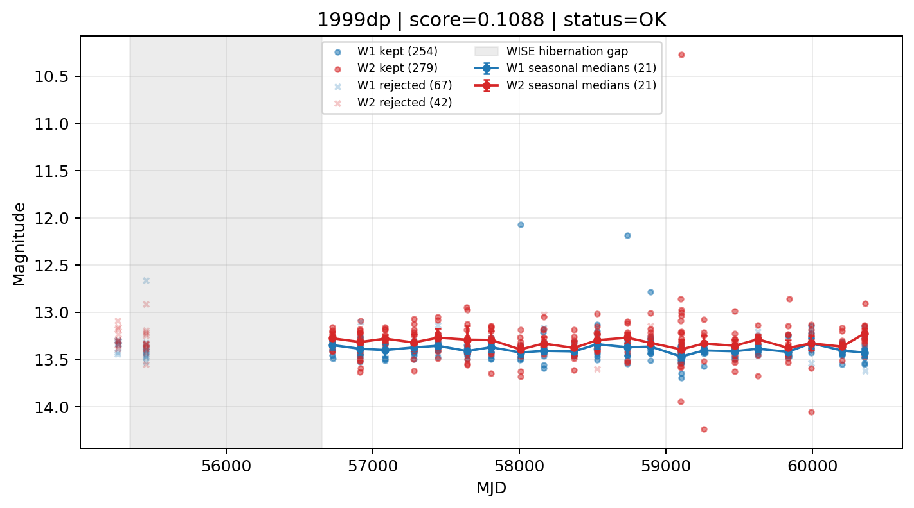

# Candidate Card: 1999dp (Rank 186)

## Basic Metadata

- `source_id`: `1999dp`
- `canonical_id`: `1999dp`
- `source_id_normalized`: `1999DP`
- `canonical_id_normalized`: `1999DP`
- `score`: `0.108797`
- `status`: `OK`
- `final_label`: `Rejected`
- `stage_a_positive`: `False`
- `gate_blazar_veto`: `True`
- `gate_wise_qc_pass`: `True`
- `gate_data_sufficient`: `True`
- `decision_trace`: `stage_a_positive=fail;gate_blazar_veto=pass;gate_wise_qc_pass=pass;gate_data_sufficient=pass;gate_state_change_ratio_pass=pass;gate_transient_spike_pass=pass`

## Sampling / Variability Summary

- `n_points` (results table): `222.0`
- `baseline_days`: `3275.67`
- `baseline_years`: `8.968`
- `band_coverage`: `W1,W2`
- `delta_mag`: `-0.022`
- `delta_mag_method`: `seasonal_median_flux`

## Coordinates

- `ra`: `67.319417`
- `dec`: `69.533500`
- `coordinate_source`: `benchmark_master`

## WISE Light Curve

## WISE QA / Rejection Accounting

| Metric | Value |
| --- | --- |
| Raw points total | 642 |
| Raw points W1 | 321 |
| Raw points W2 | 321 |
| Kept points total | 533 |
| Kept points W1 | 254 |
| Kept points W2 | 279 |
| Fraction rejected | 0.169782 |
| Reject: missing time | 0 |
| Reject: missing mag | 0 |
| Reject: invalid band | 0 |
| Reject: cc_flags | 109 |
| Reject: qual_frame | 0 |
| Reject: moon_lev | 0 |

### QA Reject Reason Counts

| reject_reason | count |
| --- | --- |
| reject_cc_flags | 109 |
| reject_invalid_band | 0 |
| reject_missing_mag | 0 |
| reject_missing_time | 0 |
| reject_moon_lev | 0 |
| reject_qual_frame | 0 |

## Flag Summary

### `cc_flags`

| value | count | fraction |
| --- | --- | --- |
| 0000 | 496 | 0.772586 |
| g000 | 60 | 0.0934579 |
| ddO0 | 52 | 0.0809969 |
| gg00 | 20 | 0.0311526 |
| 0g00 | 10 | 0.0155763 |
| h000 | 2 | 0.00311526 |
| 0h00 | 2 | 0.00311526 |

### `qual_frame`

| value | count | fraction |
| --- | --- | --- |
| <NA> | 642 | 1 |

### `moon_lev`

| value | count | fraction |
| --- | --- | --- |
| 00 | 590 | 0.919003 |
| 0000 | 52 | 0.0809969 |

### `qi_fact`

| value | count | fraction |
| --- | --- | --- |
| 1.0 | 556 | 0.866044 |
| 0.5 | 82 | 0.127726 |
| 0.0 | 4 | 0.00623053 |

### `saa_sep`

| value | count | fraction |
| --- | --- | --- |
| 107.0 | 6 | 0.00934579 |
| 76.0 | 6 | 0.00934579 |
| 113.0 | 4 | 0.00623053 |
| 77.0 | 4 | 0.00623053 |
| 82.0 | 4 | 0.00623053 |
| 97.0 | 4 | 0.00623053 |
| 105.0 | 4 | 0.00623053 |
| 118.0 | 4 | 0.00623053 |

### `ph_qual`

| value | count | fraction |
| --- | --- | --- |
| AA | 508 | 0.791277 |
| AB | 82 | 0.127726 |
| <NA> | 52 | 0.0809969 |

## Coverage Summary

- Seasonal bins (W1): `21`
- Seasonal bins (W2): `21`
- Pre-gap coverage: `False`
- Post-gap coverage: `True`
- Both-sides coverage: `False`

## Systematics Verdict

- Verdict: `CAUTION`
- Summary: Variability signal is present but data quality/coverage limitations weaken confidence.
- QA-dominated signal check: Not obviously dominated by flagged/low-quality points

Reasons:
- No clean coverage on both sides of WISE hibernation gap

## Catalog Checks

- Known blazar match: `NO`
- Known CLAGN match: `NO`
- Gaia metrics: not provided / no match

## Final Label

**Rejected**

- Rank 186 with score=0.1088
- Sampling: n_points=222.0, baseline_years=8.9682933547, band_coverage=W1,W2
- QA rejection fraction=17.0% (main causes summarized in card QA section)
- Systematics verdict=CAUTION: Variability signal is present but data quality/coverage limitations weaken confidence.
- Known blazar catalog match=NO
- Dataset metadata class=sn

## Reproducibility

- `run_timestamp_utc`: `2026-03-02T06:47:01.885248+00:00`
- `results_file`: `data/real_clagn/benchmark_scores_v2.csv`
- `wise_file`: `data/wise/1999dp.csv`
- `score_threshold`: `0.0`
- `t_recall`: `0.3493918746`
