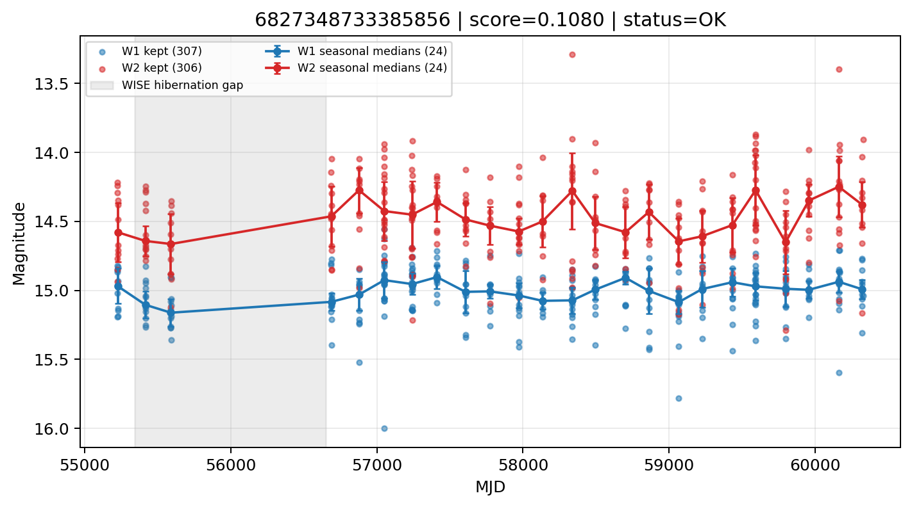

# Candidate Card: 6827348733385856 (Rank 187)

## Basic Metadata

- `source_id`: `6827348733385856`
- `canonical_id`: `6827348733385856`
- `score`: `0.107984`
- `status`: `OK`
- `final_label`: `Rejected`
- `stage_a_positive`: `False`
- `gate_blazar_veto`: `True`
- `gate_wise_qc_pass`: `True`
- `gate_data_sufficient`: `True`
- `decision_trace`: `stage_a_positive=fail;gate_blazar_veto=pass;gate_wise_qc_pass=pass;gate_data_sufficient=pass;gate_state_change_ratio_pass=pass;gate_transient_spike_pass=pass`

## Sampling / Variability Summary

- `n_points` (results table): `196.0`
- `baseline_days`: `5096.55`
- `baseline_years`: `13.954`
- `band_coverage`: `W1,W2`
- `delta_mag`: `0.085`
- `delta_mag_method`: `seasonal_median_flux`

## Coordinates

- `ra`: `44.596299`
- `dec`: `5.179078`
- `coordinate_source`: `benchmark_master`

## WISE Light Curve

## WISE QA / Rejection Accounting

| Metric | Value |
| --- | --- |
| Raw points total | 614 |
| Raw points W1 | 307 |
| Raw points W2 | 307 |
| Kept points total | 613 |
| Kept points W1 | 307 |
| Kept points W2 | 306 |
| Fraction rejected | 0.00162866 |
| Reject: missing time | 0 |
| Reject: missing mag | 1 |
| Reject: invalid band | 0 |
| Reject: cc_flags | 0 |
| Reject: qual_frame | 0 |
| Reject: moon_lev | 0 |

### QA Reject Reason Counts

| reject_reason | count |
| --- | --- |
| reject_cc_flags | 0 |
| reject_invalid_band | 0 |
| reject_missing_mag | 1 |
| reject_missing_time | 0 |
| reject_moon_lev | 0 |
| reject_qual_frame | 0 |

## Flag Summary

### `cc_flags`

| value | count | fraction |
| --- | --- | --- |
| 0000 | 614 | 1 |

### `qual_frame`

| value | count | fraction |
| --- | --- | --- |
| <NA> | 614 | 1 |

### `moon_lev`

| value | count | fraction |
| --- | --- | --- |
| 00 | 440 | 0.716612 |
| 0000 | 76 | 0.123779 |
| 11 | 68 | 0.110749 |
| 01 | 30 | 0.0488599 |

### `qi_fact`

| value | count | fraction |
| --- | --- | --- |
| 1.0 | 484 | 0.788274 |
| 0.5 | 114 | 0.185668 |
| 0.0 | 16 | 0.0260586 |

### `saa_sep`

| value | count | fraction |
| --- | --- | --- |
| 17.0 | 6 | 0.00977199 |
| 33.0 | 6 | 0.00977199 |
| 9.0 | 4 | 0.00651466 |
| 112.0 | 4 | 0.00651466 |
| 21.0 | 4 | 0.00651466 |
| 115.0 | 4 | 0.00651466 |
| 69.0 | 4 | 0.00651466 |
| 49.0 | 4 | 0.00651466 |

### `ph_qual`

| value | count | fraction |
| --- | --- | --- |
| BB | 200 | 0.325733 |
| AB | 162 | 0.263844 |
| BC | 84 | 0.136808 |
| <NA> | 76 | 0.123779 |
| AC | 40 | 0.0651466 |
| BU | 30 | 0.0488599 |
| AU | 20 | 0.0325733 |
| BX | 2 | 0.00325733 |

## Coverage Summary

- Seasonal bins (W1): `24`
- Seasonal bins (W2): `24`
- Pre-gap coverage: `True`
- Post-gap coverage: `True`
- Both-sides coverage: `True`

## Systematics Verdict

- Verdict: `PASS`
- Summary: QA-clean points and seasonal coverage support the observed variability signal.
- QA-dominated signal check: Not obviously dominated by flagged/low-quality points

Reasons:
- Seasonal trend supported by sufficient QA-clean W1/W2 points

## Catalog Checks

- Known blazar match: `NO`
- Known CLAGN match: `NO`
- Gaia metrics: not provided / no match

## Final Label

**Rejected**

- Rank 187 with score=0.1080
- Sampling: n_points=196.0, baseline_years=13.9535927579, band_coverage=W1,W2
- QA rejection fraction=0.2% (main causes summarized in card QA section)
- Systematics verdict=PASS: QA-clean points and seasonal coverage support the observed variability signal.
- Known blazar catalog match=NO
- Dataset metadata class=star

## Reproducibility

- `run_timestamp_utc`: `2026-03-02T06:47:01.885248+00:00`
- `results_file`: `data/real_clagn/benchmark_scores_v2.csv`
- `wise_file`: `data/wise/6827348733385856.csv`
- `score_threshold`: `0.0`
- `t_recall`: `0.3493918746`
