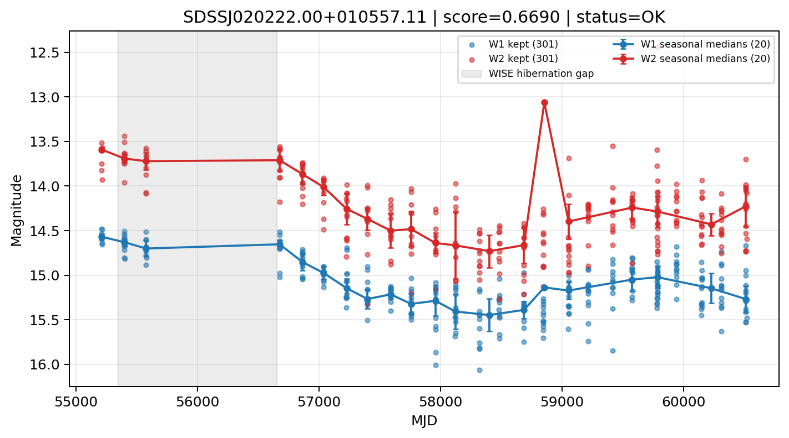

# Candidate Card: SDSSJ020222.00+010557.11 (Rank 19)

## Basic Metadata

- `source_id`: `SDSSJJ020222.00+010557.11`
- `canonical_id`: `SDSSJ020222.00+010557.11`
- `source_id_normalized`: `SDSSJ020222.00+010557.11`
- `score`: `0.669048`
- `status`: `OK`
- `final_label`: `Known AGN`
- `stage_a_positive`: `True`
- `gate_blazar_veto`: `True`
- `gate_wise_qc_pass`: `True`
- `gate_data_sufficient`: `True`
- `decision_trace`: `stage_a_positive=pass;gate_blazar_veto=pass;gate_wise_qc_pass=pass;gate_data_sufficient=pass;gate_state_change_ratio_pass=pass;gate_transient_spike_pass=pass`

## Sampling / Variability Summary

- `n_points` (results table): `147.0`
- `baseline_days`: `5300.56`
- `baseline_years`: `14.512`
- `band_coverage`: `W1,W2`
- `delta_mag`: `-0.435`
- `delta_mag_method`: `seasonal_median_flux`

## Coordinates

- `ra`: `30.591690`
- `dec`: `1.099190`
- `coordinate_source`: `benchmark_master`

## WISE Light Curve

## WISE QA / Rejection Accounting

| Metric | Value |
| --- | --- |
| Raw points total | 602 |
| Raw points W1 | 301 |
| Raw points W2 | 301 |
| Kept points total | 602 |
| Kept points W1 | 301 |
| Kept points W2 | 301 |
| Fraction rejected | 0 |
| Reject: missing time | 0 |
| Reject: missing mag | 0 |
| Reject: invalid band | 0 |
| Reject: cc_flags | 0 |
| Reject: qual_frame | 0 |
| Reject: moon_lev | 0 |

### QA Reject Reason Counts

| reject_reason | count |
| --- | --- |
| reject_cc_flags | 0 |
| reject_invalid_band | 0 |
| reject_missing_mag | 0 |
| reject_missing_time | 0 |
| reject_moon_lev | 0 |
| reject_qual_frame | 0 |

## Flag Summary

### `cc_flags`

| value | count | fraction |
| --- | --- | --- |
| 0000 | 602 | 1 |

### `qual_frame`

| value | count | fraction |
| --- | --- | --- |
| <NA> | 602 | 1 |

### `moon_lev`

| value | count | fraction |
| --- | --- | --- |
| 00 | 520 | 0.863787 |
| 0000 | 48 | 0.0797342 |
| 11 | 18 | 0.0299003 |
| 0011 | 16 | 0.0265781 |

### `qi_fact`

| value | count | fraction |
| --- | --- | --- |
| 1.0 | 328 | 0.54485 |
| 0.5 | 212 | 0.352159 |
| 0.0 | 62 | 0.10299 |

### `saa_sep`

| value | count | fraction |
| --- | --- | --- |
| 50.0 | 4 | 0.00664452 |
| 22.0 | 4 | 0.00664452 |
| 4.0 | 4 | 0.00664452 |
| 25.83300018310547 | 4 | 0.00664452 |
| 55.0 | 4 | 0.00664452 |
| 97.0 | 4 | 0.00664452 |
| 61.0 | 4 | 0.00664452 |
| 25.0 | 4 | 0.00664452 |

### `ph_qual`

| value | count | fraction |
| --- | --- | --- |
| BB | 302 | 0.501661 |
| AB | 102 | 0.169435 |
| <NA> | 64 | 0.106312 |
| BC | 62 | 0.10299 |
| BU | 62 | 0.10299 |
| AC | 4 | 0.00664452 |
| AA | 2 | 0.00332226 |
| CC | 2 | 0.00332226 |

## Coverage Summary

- Seasonal bins (W1): `20`
- Seasonal bins (W2): `20`
- Pre-gap coverage: `True`
- Post-gap coverage: `True`
- Both-sides coverage: `True`

## Systematics Verdict

- Verdict: `PASS`
- Summary: QA-clean points and seasonal coverage support the observed variability signal.
- QA-dominated signal check: Not obviously dominated by flagged/low-quality points

Reasons:
- Seasonal trend supported by sufficient QA-clean W1/W2 points

## Catalog Checks

- Known blazar match: `NO`
- Known CLAGN match: `NO`
- Gaia metrics: not provided / no match

## Final Label

**Known AGN**

- Rank 19 with score=0.6690
- Sampling: n_points=147.0, baseline_years=14.5121443305, band_coverage=W1,W2
- QA rejection fraction=0.0% (main causes summarized in card QA section)
- Systematics verdict=PASS: QA-clean points and seasonal coverage support the observed variability signal.
- Known blazar catalog match=NO
- Dataset metadata class=clagn

## Reproducibility

- `run_timestamp_utc`: `2026-03-02T06:47:01.885248+00:00`
- `results_file`: `data/real_clagn/benchmark_scores_v2.csv`
- `wise_file`: `data/wise/SDSSJ020222.00+010557.11.csv`
- `score_threshold`: `0.0`
- `t_recall`: `0.3493918746`
