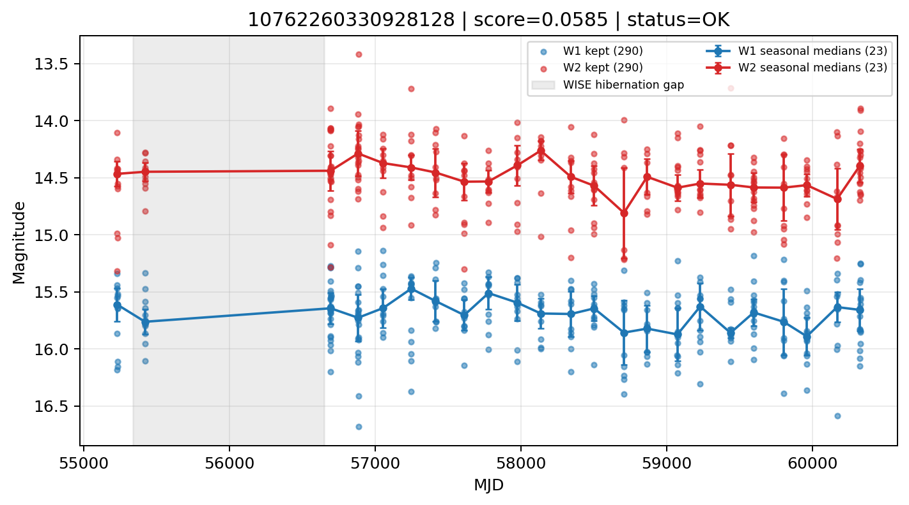

# Candidate Card: 10762260330928128 (Rank 204)

## Basic Metadata

- `source_id`: `10762260330928128`
- `canonical_id`: `10762260330928128`
- `score`: `0.058494`
- `status`: `OK`
- `final_label`: `Rejected`
- `stage_a_positive`: `False`
- `gate_blazar_veto`: `True`
- `gate_wise_qc_pass`: `True`
- `gate_data_sufficient`: `True`
- `decision_trace`: `stage_a_positive=fail;gate_blazar_veto=pass;gate_wise_qc_pass=pass;gate_data_sufficient=pass;gate_state_change_ratio_pass=pass;gate_transient_spike_pass=pass`

## Sampling / Variability Summary

- `n_points` (results table): `178.0`
- `baseline_days`: `5099.23`
- `baseline_years`: `13.961`
- `band_coverage`: `W1,W2`
- `delta_mag`: `0.035`
- `delta_mag_method`: `seasonal_median_flux`

## Coordinates

- `ra`: `50.906189`
- `dec`: `7.910208`
- `coordinate_source`: `benchmark_master`

## WISE Light Curve

## WISE QA / Rejection Accounting

| Metric | Value |
| --- | --- |
| Raw points total | 580 |
| Raw points W1 | 290 |
| Raw points W2 | 290 |
| Kept points total | 580 |
| Kept points W1 | 290 |
| Kept points W2 | 290 |
| Fraction rejected | 0 |
| Reject: missing time | 0 |
| Reject: missing mag | 0 |
| Reject: invalid band | 0 |
| Reject: cc_flags | 0 |
| Reject: qual_frame | 0 |
| Reject: moon_lev | 0 |

### QA Reject Reason Counts

| reject_reason | count |
| --- | --- |
| reject_cc_flags | 0 |
| reject_invalid_band | 0 |
| reject_missing_mag | 0 |
| reject_missing_time | 0 |
| reject_moon_lev | 0 |
| reject_qual_frame | 0 |

## Flag Summary

### `cc_flags`

| value | count | fraction |
| --- | --- | --- |
| 0000 | 580 | 1 |

### `qual_frame`

| value | count | fraction |
| --- | --- | --- |
| <NA> | 580 | 1 |

### `moon_lev`

| value | count | fraction |
| --- | --- | --- |
| 00 | 456 | 0.786207 |
| 0000 | 50 | 0.0862069 |
| 11 | 40 | 0.0689655 |
| 01 | 34 | 0.0586207 |

### `qi_fact`

| value | count | fraction |
| --- | --- | --- |
| 1.000000 | 438 | 0.755172 |
| 0.500000 | 120 | 0.206897 |
| 0.000000 | 22 | 0.037931 |

### `saa_sep`

| value | count | fraction |
| --- | --- | --- |
| 48.702000 | 4 | 0.00689655 |
| 101.000000 | 4 | 0.00689655 |
| 26.000000 | 4 | 0.00689655 |
| 15.000000 | 4 | 0.00689655 |
| 125.896004 | 4 | 0.00689655 |
| 94.452003 | 2 | 0.00344828 |
| 22.980000 | 2 | 0.00344828 |
| 34.231998 | 2 | 0.00344828 |

### `ph_qual`

| value | count | fraction |
| --- | --- | --- |
| BB | 352 | 0.606897 |
| BC | 104 | 0.17931 |
| <NA> | 50 | 0.0862069 |
| BU | 48 | 0.0827586 |
| CB | 14 | 0.0241379 |
| CU | 6 | 0.0103448 |
| UB | 2 | 0.00344828 |
| UC | 2 | 0.00344828 |

## Coverage Summary

- Seasonal bins (W1): `23`
- Seasonal bins (W2): `23`
- Pre-gap coverage: `True`
- Post-gap coverage: `True`
- Both-sides coverage: `True`

## Systematics Verdict

- Verdict: `PASS`
- Summary: QA-clean points and seasonal coverage support the observed variability signal.
- QA-dominated signal check: Not obviously dominated by flagged/low-quality points

Reasons:
- Seasonal trend supported by sufficient QA-clean W1/W2 points

## Catalog Checks

- Known blazar match: `NO`
- Known CLAGN match: `NO`
- Gaia metrics: not provided / no match

## Final Label

**Rejected**

- Rank 204 with score=0.0585
- Sampling: n_points=178.0, baseline_years=13.960932874, band_coverage=W1,W2
- QA rejection fraction=0.0% (main causes summarized in card QA section)
- Systematics verdict=PASS: QA-clean points and seasonal coverage support the observed variability signal.
- Known blazar catalog match=NO
- Dataset metadata class=star

## Reproducibility

- `run_timestamp_utc`: `2026-03-02T06:47:01.885248+00:00`
- `results_file`: `data/real_clagn/benchmark_scores_v2.csv`
- `wise_file`: `data/wise/10762260330928128.csv`
- `score_threshold`: `0.0`
- `t_recall`: `0.3493918746`
