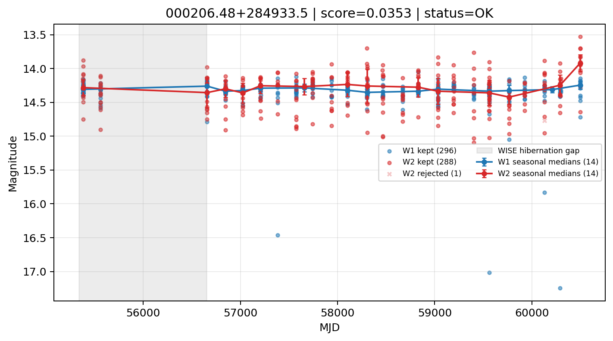

# Candidate Card: 000206.48+284933.5 (Rank 208)

## Basic Metadata

- `source_id`: `000206.48+284933.5`
- `canonical_id`: `000206.48+284933.5`
- `score`: `0.035278`
- `status`: `OK`
- `final_label`: `Rejected`
- `stage_a_positive`: `False`
- `gate_blazar_veto`: `True`
- `gate_wise_qc_pass`: `True`
- `gate_data_sufficient`: `True`
- `decision_trace`: `stage_a_positive=fail;gate_blazar_veto=pass;gate_wise_qc_pass=pass;gate_data_sufficient=pass;gate_state_change_ratio_pass=pass;gate_transient_spike_pass=pass`

## Sampling / Variability Summary

- `n_points` (results table): `228.0`
- `baseline_days`: `5116.43`
- `baseline_years`: `14.008`
- `band_coverage`: `W1,W2`
- `delta_mag`: `0.013`
- `delta_mag_method`: `seasonal_median_flux`

## Coordinates

- `ra`: `0.527003`
- `dec`: `28.825991`
- `coordinate_source`: `benchmark_master`

## WISE Light Curve

## WISE QA / Rejection Accounting

| Metric | Value |
| --- | --- |
| Raw points total | 592 |
| Raw points W1 | 296 |
| Raw points W2 | 296 |
| Kept points total | 584 |
| Kept points W1 | 296 |
| Kept points W2 | 288 |
| Fraction rejected | 0.0135135 |
| Reject: missing time | 0 |
| Reject: missing mag | 7 |
| Reject: invalid band | 0 |
| Reject: cc_flags | 1 |
| Reject: qual_frame | 0 |
| Reject: moon_lev | 0 |

### QA Reject Reason Counts

| reject_reason | count |
| --- | --- |
| reject_cc_flags | 1 |
| reject_invalid_band | 0 |
| reject_missing_mag | 7 |
| reject_missing_time | 0 |
| reject_moon_lev | 0 |
| reject_qual_frame | 0 |

## Flag Summary

### `cc_flags`

| value | count | fraction |
| --- | --- | --- |
| 0000 | 590 | 0.996622 |
| 0H00 | 2 | 0.00337838 |

### `qual_frame`

| value | count | fraction |
| --- | --- | --- |
| <NA> | 592 | 1 |

### `moon_lev`

| value | count | fraction |
| --- | --- | --- |
| 00 | 514 | 0.868243 |
| 0000 | 44 | 0.0743243 |
| 0011 | 20 | 0.0337838 |
| 0111 | 14 | 0.0236486 |

### `qi_fact`

| value | count | fraction |
| --- | --- | --- |
| 1.000000 | 498 | 0.841216 |
| 0.500000 | 84 | 0.141892 |
| 0.000000 | 10 | 0.0168919 |

### `saa_sep`

| value | count | fraction |
| --- | --- | --- |
| 64.000000 | 4 | 0.00675676 |
| 100.000000 | 4 | 0.00675676 |
| 96.000000 | 4 | 0.00675676 |
| 116.081001 | 4 | 0.00675676 |
| 34.000000 | 4 | 0.00675676 |
| 40.366001 | 4 | 0.00675676 |
| 41.000000 | 4 | 0.00675676 |
| 43.287998 | 4 | 0.00675676 |

### `ph_qual`

| value | count | fraction |
| --- | --- | --- |
| AB | 388 | 0.655405 |
| <NA> | 78 | 0.131757 |
| AC | 54 | 0.0912162 |
| AU | 44 | 0.0743243 |
| BB | 10 | 0.0168919 |
| BC | 6 | 0.0101351 |
| UB | 4 | 0.00675676 |
| BU | 4 | 0.00675676 |

## Coverage Summary

- Seasonal bins (W1): `14`
- Seasonal bins (W2): `14`
- Pre-gap coverage: `False`
- Post-gap coverage: `True`
- Both-sides coverage: `False`

## Systematics Verdict

- Verdict: `CAUTION`
- Summary: Variability signal is present but data quality/coverage limitations weaken confidence.
- QA-dominated signal check: Not obviously dominated by flagged/low-quality points

Reasons:
- No clean coverage on both sides of WISE hibernation gap

## Catalog Checks

- Known blazar match: `NO`
- Known CLAGN match: `NO`
- Gaia metrics: not provided / no match

## Final Label

**Rejected**

- Rank 208 with score=0.0353
- Sampling: n_points=228.0, baseline_years=14.0080099714, band_coverage=W1,W2
- QA rejection fraction=1.4% (main causes summarized in card QA section)
- Systematics verdict=CAUTION: Variability signal is present but data quality/coverage limitations weaken confidence.
- Known blazar catalog match=NO
- Dataset metadata class=normal_agn

## Reproducibility

- `run_timestamp_utc`: `2026-03-02T06:47:01.885248+00:00`
- `results_file`: `data/real_clagn/benchmark_scores_v2.csv`
- `wise_file`: `data/wise/000206.48+284933.5.csv`
- `score_threshold`: `0.0`
- `t_recall`: `0.3493918746`
