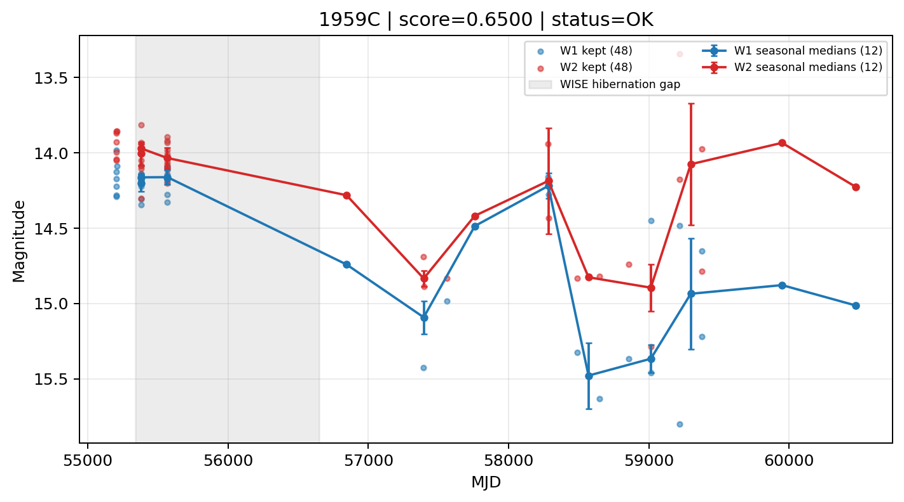

# Candidate Card: 1959C (Rank 22)

## Basic Metadata

- `source_id`: `1959C`
- `canonical_id`: `1959C`
- `score`: `0.650000`
- `status`: `OK`
- `final_label`: `Rejected`
- `stage_a_positive`: `True`
- `gate_blazar_veto`: `True`
- `gate_wise_qc_pass`: `True`
- `gate_data_sufficient`: `True`
- `decision_trace`: `stage_a_positive=pass;gate_blazar_veto=pass;gate_wise_qc_pass=pass;gate_data_sufficient=pass;gate_state_change_ratio_pass=pass;gate_transient_spike_pass=pass`

## Sampling / Variability Summary

- `n_points` (results table): `46.0`
- `baseline_days`: `5268.45`
- `baseline_years`: `14.424`
- `band_coverage`: `W1,W2`
- `delta_mag`: `0.000`
- `delta_mag_method`: `seasonal_median_flux`

## Coordinates

- `ra`: `197.849250`
- `dec`: `3.410500`
- `coordinate_source`: `benchmark_master`

## WISE Light Curve

## WISE QA / Rejection Accounting

| Metric | Value |
| --- | --- |
| Raw points total | 96 |
| Raw points W1 | 48 |
| Raw points W2 | 48 |
| Kept points total | 96 |
| Kept points W1 | 48 |
| Kept points W2 | 48 |
| Fraction rejected | 0 |
| Reject: missing time | 0 |
| Reject: missing mag | 0 |
| Reject: invalid band | 0 |
| Reject: cc_flags | 0 |
| Reject: qual_frame | 0 |
| Reject: moon_lev | 0 |

### QA Reject Reason Counts

| reject_reason | count |
| --- | --- |
| reject_cc_flags | 0 |
| reject_invalid_band | 0 |
| reject_missing_mag | 0 |
| reject_missing_time | 0 |
| reject_moon_lev | 0 |
| reject_qual_frame | 0 |

## Flag Summary

### `cc_flags`

| value | count | fraction |
| --- | --- | --- |
| 0000 | 96 | 1 |

### `qual_frame`

| value | count | fraction |
| --- | --- | --- |
| <NA> | 96 | 1 |

### `moon_lev`

| value | count | fraction |
| --- | --- | --- |
| 0000 | 60 | 0.625 |
| 00 | 34 | 0.354167 |
| 11 | 2 | 0.0208333 |

### `qi_fact`

| value | count | fraction |
| --- | --- | --- |
| 1.0 | 96 | 1 |

### `saa_sep`

| value | count | fraction |
| --- | --- | --- |
| 32.0 | 4 | 0.0416667 |
| 86.0 | 4 | 0.0416667 |
| 15.0 | 4 | 0.0416667 |
| 45.0 | 2 | 0.0208333 |
| 79.0 | 2 | 0.0208333 |
| 8.032999992370605 | 2 | 0.0208333 |
| 10.906999588012695 | 2 | 0.0208333 |
| 18.06399917602539 | 2 | 0.0208333 |

### `ph_qual`

| value | count | fraction |
| --- | --- | --- |
| <NA> | 60 | 0.625 |
| AB | 10 | 0.104167 |
| BB | 10 | 0.104167 |
| BC | 10 | 0.104167 |
| BU | 4 | 0.0416667 |
| AU | 2 | 0.0208333 |

## Coverage Summary

- Seasonal bins (W1): `12`
- Seasonal bins (W2): `12`
- Pre-gap coverage: `True`
- Post-gap coverage: `True`
- Both-sides coverage: `True`

## Systematics Verdict

- Verdict: `PASS`
- Summary: QA-clean points and seasonal coverage support the observed variability signal.
- QA-dominated signal check: Not obviously dominated by flagged/low-quality points

Reasons:
- Seasonal trend supported by sufficient QA-clean W1/W2 points

## Catalog Checks

- Known blazar match: `NO`
- Known CLAGN match: `NO`
- Gaia metrics: not provided / no match

## Final Label

**Rejected**

- Rank 22 with score=0.6500
- Sampling: n_points=46.0, baseline_years=14.4242274273, band_coverage=W1,W2
- QA rejection fraction=0.0% (main causes summarized in card QA section)
- Systematics verdict=PASS: QA-clean points and seasonal coverage support the observed variability signal.
- Known blazar catalog match=NO
- Dataset metadata class=sn
- Rejected because dataset metadata class=sn is a known contaminant class

## Reproducibility

- `run_timestamp_utc`: `2026-03-02T06:47:01.885248+00:00`
- `results_file`: `data/real_clagn/benchmark_scores_v2.csv`
- `wise_file`: `data/wise/1959C.csv`
- `score_threshold`: `0.0`
- `t_recall`: `0.3493918746`
