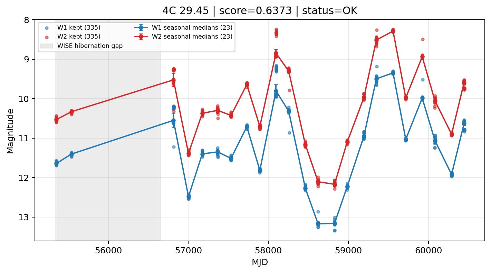

# Candidate Card: 4C 29.45 (Rank 27)

## Basic Metadata

- `source_id`: `4C 29.45`
- `canonical_id`: `4C 29.45`
- `score`: `0.637300`
- `status`: `OK`
- `final_label`: `Known blazar`
- `stage_a_positive`: `True`
- `gate_blazar_veto`: `False`
- `gate_wise_qc_pass`: `True`
- `gate_data_sufficient`: `True`
- `decision_trace`: `stage_a_positive=pass;gate_blazar_veto=fail;gate_wise_qc_pass=pass;gate_data_sufficient=pass;gate_state_change_ratio_pass=pass;gate_transient_spike_pass=pass`

## Sampling / Variability Summary

- `n_points` (results table): `135.0`
- `baseline_days`: `5098.25`
- `baseline_years`: `13.958`
- `band_coverage`: `W1,W2`
- `delta_mag`: `-0.257`
- `delta_mag_method`: `seasonal_median_flux`

## Coordinates

- `ra`: `179.882600`
- `dec`: `29.245500`
- `coordinate_source`: `benchmark_master`

## WISE Light Curve

## WISE QA / Rejection Accounting

| Metric | Value |
| --- | --- |
| Raw points total | 670 |
| Raw points W1 | 335 |
| Raw points W2 | 335 |
| Kept points total | 670 |
| Kept points W1 | 335 |
| Kept points W2 | 335 |
| Fraction rejected | 0 |
| Reject: missing time | 0 |
| Reject: missing mag | 0 |
| Reject: invalid band | 0 |
| Reject: cc_flags | 0 |
| Reject: qual_frame | 0 |
| Reject: moon_lev | 0 |

### QA Reject Reason Counts

| reject_reason | count |
| --- | --- |
| reject_cc_flags | 0 |
| reject_invalid_band | 0 |
| reject_missing_mag | 0 |
| reject_missing_time | 0 |
| reject_moon_lev | 0 |
| reject_qual_frame | 0 |

## Flag Summary

### `cc_flags`

| value | count | fraction |
| --- | --- | --- |
| 0000 | 670 | 1 |

### `qual_frame`

| value | count | fraction |
| --- | --- | --- |
| <NA> | 670 | 1 |

### `moon_lev`

| value | count | fraction |
| --- | --- | --- |
| 00 | 606 | 0.904478 |
| 0000 | 50 | 0.0746269 |
| 01 | 14 | 0.0208955 |

### `qi_fact`

| value | count | fraction |
| --- | --- | --- |
| 0.5 | 358 | 0.534328 |
| 1.0 | 300 | 0.447761 |
| 0.0 | 12 | 0.0179104 |

### `saa_sep`

| value | count | fraction |
| --- | --- | --- |
| 41.0 | 6 | 0.00895522 |
| 105.0 | 4 | 0.00597015 |
| 124.0 | 4 | 0.00597015 |
| 56.0 | 4 | 0.00597015 |
| 74.0 | 4 | 0.00597015 |
| 128.11599731445312 | 2 | 0.00298507 |
| 26.565000534057617 | 2 | 0.00298507 |
| 35.683998107910156 | 2 | 0.00298507 |

### `ph_qual`

| value | count | fraction |
| --- | --- | --- |
| AA | 620 | 0.925373 |
| <NA> | 50 | 0.0746269 |

## Coverage Summary

- Seasonal bins (W1): `23`
- Seasonal bins (W2): `23`
- Pre-gap coverage: `False`
- Post-gap coverage: `True`
- Both-sides coverage: `False`

## Systematics Verdict

- Verdict: `CAUTION`
- Summary: Variability signal is present but data quality/coverage limitations weaken confidence.
- QA-dominated signal check: Not obviously dominated by flagged/low-quality points

Reasons:
- No clean coverage on both sides of WISE hibernation gap

## Catalog Checks

- Known blazar match: `YES` via `source_id` token `4C 29.45`
- Known CLAGN match: `NO`
- Gaia metrics: not provided / no match

## Final Label

**Known blazar**

- Rank 27 with score=0.6373
- Sampling: n_points=135.0, baseline_years=13.9582355616, band_coverage=W1,W2
- QA rejection fraction=0.0% (main causes summarized in card QA section)
- Systematics verdict=CAUTION: Variability signal is present but data quality/coverage limitations weaken confidence.
- Known blazar catalog match=YES
- Dataset metadata class=blazar

## Reproducibility

- `run_timestamp_utc`: `2026-03-02T06:47:01.885248+00:00`
- `results_file`: `data/real_clagn/benchmark_scores_v2.csv`
- `wise_file`: `data/wise/4C 29.45.csv`
- `score_threshold`: `0.0`
- `t_recall`: `0.3493918746`
