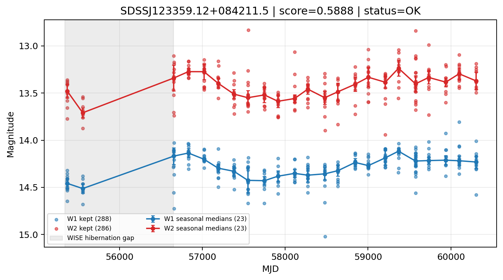

# Candidate Card: SDSSJ123359.12+084211.5 (Rank 37)

## Basic Metadata

- `source_id`: `SDSSJ123359.12+084211.5`
- `canonical_id`: `SDSSJ123359.12+084211.5`
- `score`: `0.588818`
- `status`: `OK`
- `final_label`: `Known AGN`
- `stage_a_positive`: `True`
- `gate_blazar_veto`: `True`
- `gate_wise_qc_pass`: `True`
- `gate_data_sufficient`: `True`
- `decision_trace`: `stage_a_positive=pass;gate_blazar_veto=pass;gate_wise_qc_pass=pass;gate_data_sufficient=pass;gate_state_change_ratio_pass=pass;gate_transient_spike_pass=pass`

## Sampling / Variability Summary

- `n_points` (results table): `170.0`
- `baseline_days`: `4936.05`
- `baseline_years`: `13.514`
- `band_coverage`: `W1,W2`
- `delta_mag`: `0.290`
- `delta_mag_method`: `seasonal_median_flux`

## Coordinates

- `ra`: `188.496370`
- `dec`: `8.703230`
- `coordinate_source`: `benchmark_master`

## WISE Light Curve

## WISE QA / Rejection Accounting

| Metric | Value |
| --- | --- |
| Raw points total | 576 |
| Raw points W1 | 288 |
| Raw points W2 | 288 |
| Kept points total | 574 |
| Kept points W1 | 288 |
| Kept points W2 | 286 |
| Fraction rejected | 0.00347222 |
| Reject: missing time | 0 |
| Reject: missing mag | 2 |
| Reject: invalid band | 0 |
| Reject: cc_flags | 0 |
| Reject: qual_frame | 0 |
| Reject: moon_lev | 0 |

### QA Reject Reason Counts

| reject_reason | count |
| --- | --- |
| reject_cc_flags | 0 |
| reject_invalid_band | 0 |
| reject_missing_mag | 2 |
| reject_missing_time | 0 |
| reject_moon_lev | 0 |
| reject_qual_frame | 0 |

## Flag Summary

### `cc_flags`

| value | count | fraction |
| --- | --- | --- |
| 0000 | 576 | 1 |

### `qual_frame`

| value | count | fraction |
| --- | --- | --- |
| <NA> | 576 | 1 |

### `moon_lev`

| value | count | fraction |
| --- | --- | --- |
| 00 | 496 | 0.861111 |
| 11 | 32 | 0.0555556 |
| 0011 | 24 | 0.0416667 |
| 0000 | 20 | 0.0347222 |
| 1111 | 4 | 0.00694444 |

### `qi_fact`

| value | count | fraction |
| --- | --- | --- |
| 1.0 | 396 | 0.6875 |
| 0.5 | 158 | 0.274306 |
| 0.0 | 22 | 0.0381944 |

### `saa_sep`

| value | count | fraction |
| --- | --- | --- |
| 33.0 | 2 | 0.00347222 |
| 87.0 | 2 | 0.00347222 |
| 55.676998138427734 | 2 | 0.00347222 |
| 32.595001220703125 | 2 | 0.00347222 |
| 53.790000915527344 | 2 | 0.00347222 |
| 118.45899963378906 | 2 | 0.00347222 |
| 22.625 | 2 | 0.00347222 |
| 33.2869987487793 | 2 | 0.00347222 |

### `ph_qual`

| value | count | fraction |
| --- | --- | --- |
| AA | 296 | 0.513889 |
| AB | 218 | 0.378472 |
| <NA> | 48 | 0.0833333 |
| BB | 8 | 0.0138889 |
| BA | 2 | 0.00347222 |
| BU | 2 | 0.00347222 |
| AU | 2 | 0.00347222 |

## Coverage Summary

- Seasonal bins (W1): `23`
- Seasonal bins (W2): `23`
- Pre-gap coverage: `False`
- Post-gap coverage: `True`
- Both-sides coverage: `False`

## Systematics Verdict

- Verdict: `CAUTION`
- Summary: Variability signal is present but data quality/coverage limitations weaken confidence.
- QA-dominated signal check: Not obviously dominated by flagged/low-quality points

Reasons:
- No clean coverage on both sides of WISE hibernation gap

## Catalog Checks

- Known blazar match: `NO`
- Known CLAGN match: `YES` (method=coordinate)
- Gaia metrics: not provided / no match

## Final Label

**Known AGN**

- Rank 37 with score=0.5888
- Sampling: n_points=170.0, baseline_years=13.5141600934, band_coverage=W1,W2
- QA rejection fraction=0.3% (main causes summarized in card QA section)
- Systematics verdict=CAUTION: Variability signal is present but data quality/coverage limitations weaken confidence.
- Known blazar catalog match=NO
- Dataset metadata class=clagn
- Known CLAGN file match=YES

## Reproducibility

- `run_timestamp_utc`: `2026-03-02T06:47:01.885248+00:00`
- `results_file`: `data/real_clagn/benchmark_scores_v2.csv`
- `wise_file`: `data/wise/SDSSJ123359.12+084211.5.csv`
- `score_threshold`: `0.0`
- `t_recall`: `0.3493918746`
