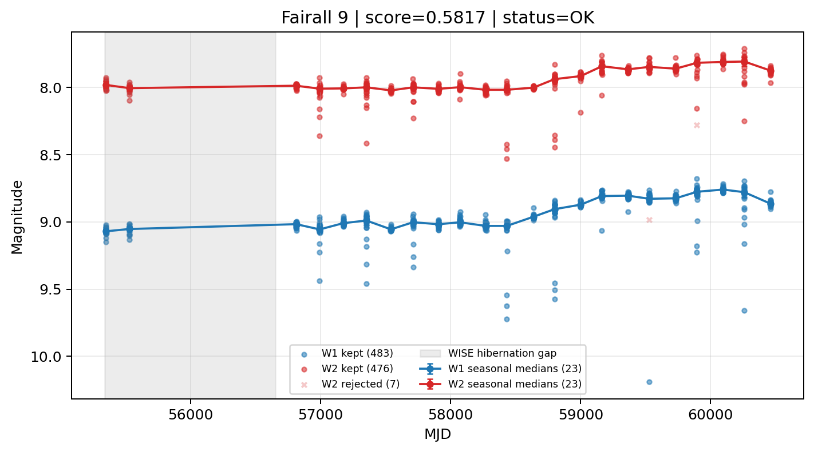

# Candidate Card: Fairall 9 (Rank 39)

## Basic Metadata

- `source_id`: `Fairall 9`
- `canonical_id`: `Fairall 9`
- `source_id_normalized`: `FAIRALL 9`
- `canonical_id_normalized`: `FAIRALL 9`
- `score`: `0.581710`
- `status`: `OK`
- `final_label`: `Known blazar`
- `stage_a_positive`: `True`
- `gate_blazar_veto`: `False`
- `gate_wise_qc_pass`: `True`
- `gate_data_sufficient`: `True`
- `decision_trace`: `stage_a_positive=pass;gate_blazar_veto=fail;gate_wise_qc_pass=pass;gate_data_sufficient=pass;gate_state_change_ratio_pass=pass;gate_transient_spike_pass=pass`

## Sampling / Variability Summary

- `n_points` (results table): `247.0`
- `baseline_days`: `5113.91`
- `baseline_years`: `14.001`
- `band_coverage`: `W1,W2`
- `delta_mag`: `0.235`
- `delta_mag_method`: `seasonal_median_flux`

## Coordinates

- `ra`: `20.941700`
- `dec`: `-58.806600`
- `coordinate_source`: `benchmark_master`

## WISE Light Curve

## WISE QA / Rejection Accounting

| Metric | Value |
| --- | --- |
| Raw points total | 966 |
| Raw points W1 | 483 |
| Raw points W2 | 483 |
| Kept points total | 959 |
| Kept points W1 | 483 |
| Kept points W2 | 476 |
| Fraction rejected | 0.00724638 |
| Reject: missing time | 0 |
| Reject: missing mag | 0 |
| Reject: invalid band | 0 |
| Reject: cc_flags | 7 |
| Reject: qual_frame | 0 |
| Reject: moon_lev | 0 |

### QA Reject Reason Counts

| reject_reason | count |
| --- | --- |
| reject_cc_flags | 7 |
| reject_invalid_band | 0 |
| reject_missing_mag | 0 |
| reject_missing_time | 0 |
| reject_moon_lev | 0 |
| reject_qual_frame | 0 |

## Flag Summary

### `cc_flags`

| value | count | fraction |
| --- | --- | --- |
| 0000 | 952 | 0.985507 |
| 0d00 | 8 | 0.00828157 |
| 0H00 | 4 | 0.00414079 |
| 0h00 | 2 | 0.00207039 |

### `qual_frame`

| value | count | fraction |
| --- | --- | --- |
| <NA> | 966 | 1 |

### `moon_lev`

| value | count | fraction |
| --- | --- | --- |
| 00 | 904 | 0.935818 |
| 0000 | 62 | 0.0641822 |

### `qi_fact`

| value | count | fraction |
| --- | --- | --- |
| 1.0 | 536 | 0.554865 |
| 0.5 | 254 | 0.26294 |
| 0.0 | 176 | 0.182195 |

### `saa_sep`

| value | count | fraction |
| --- | --- | --- |
| 18.0 | 6 | 0.00621118 |
| 59.0 | 4 | 0.00414079 |
| 60.59299850463867 | 4 | 0.00414079 |
| 60.0 | 4 | 0.00414079 |
| 57.0 | 4 | 0.00414079 |
| 54.0 | 4 | 0.00414079 |
| 19.0 | 4 | 0.00414079 |
| 32.388999938964844 | 4 | 0.00414079 |

### `ph_qual`

| value | count | fraction |
| --- | --- | --- |
| AA | 904 | 0.935818 |
| <NA> | 62 | 0.0641822 |

## Coverage Summary

- Seasonal bins (W1): `23`
- Seasonal bins (W2): `23`
- Pre-gap coverage: `False`
- Post-gap coverage: `True`
- Both-sides coverage: `False`

## Systematics Verdict

- Verdict: `CAUTION`
- Summary: Variability signal is present but data quality/coverage limitations weaken confidence.
- QA-dominated signal check: Not obviously dominated by flagged/low-quality points

Reasons:
- No clean coverage on both sides of WISE hibernation gap

## Catalog Checks

- Known blazar match: `YES` via `source_id` token `FAIRALL 9`
- Known CLAGN match: `NO`
- Gaia metrics: not provided / no match

## Final Label

**Known blazar**

- Rank 39 with score=0.5817
- Sampling: n_points=247.0, baseline_years=14.0011138382, band_coverage=W1,W2
- QA rejection fraction=0.7% (main causes summarized in card QA section)
- Systematics verdict=CAUTION: Variability signal is present but data quality/coverage limitations weaken confidence.
- Known blazar catalog match=YES
- Dataset metadata class=blazar

## Reproducibility

- `run_timestamp_utc`: `2026-03-02T06:47:01.885248+00:00`
- `results_file`: `data/real_clagn/benchmark_scores_v2.csv`
- `wise_file`: `data/wise/Fairall 9.csv`
- `score_threshold`: `0.0`
- `t_recall`: `0.3493918746`
