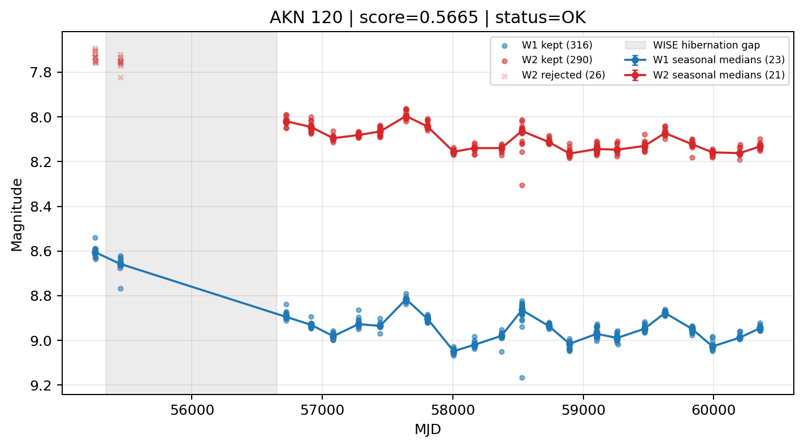

# Candidate Card: AKN 120 (Rank 45)

## Basic Metadata

- `source_id`: `AKN 120`
- `canonical_id`: `AKN 120`
- `score`: `0.566539`
- `status`: `OK`
- `final_label`: `Known blazar`
- `stage_a_positive`: `True`
- `gate_blazar_veto`: `False`
- `gate_wise_qc_pass`: `True`
- `gate_data_sufficient`: `True`
- `decision_trace`: `stage_a_positive=pass;gate_blazar_veto=fail;gate_wise_qc_pass=pass;gate_data_sufficient=pass;gate_state_change_ratio_pass=pass;gate_transient_spike_pass=pass`

## Sampling / Variability Summary

- `n_points` (results table): `253.0`
- `baseline_days`: `5100.00`
- `baseline_years`: `13.963`
- `band_coverage`: `W1,W2`
- `delta_mag`: `-0.334`
- `delta_mag_method`: `seasonal_median_flux`

## Coordinates

- `ra`: `79.047800`
- `dec`: `-0.150200`
- `coordinate_source`: `benchmark_master`

## WISE Light Curve

## WISE QA / Rejection Accounting

| Metric | Value |
| --- | --- |
| Raw points total | 632 |
| Raw points W1 | 316 |
| Raw points W2 | 316 |
| Kept points total | 606 |
| Kept points W1 | 316 |
| Kept points W2 | 290 |
| Fraction rejected | 0.0411392 |
| Reject: missing time | 0 |
| Reject: missing mag | 0 |
| Reject: invalid band | 0 |
| Reject: cc_flags | 26 |
| Reject: qual_frame | 0 |
| Reject: moon_lev | 0 |

### QA Reject Reason Counts

| reject_reason | count |
| --- | --- |
| reject_cc_flags | 26 |
| reject_invalid_band | 0 |
| reject_missing_mag | 0 |
| reject_missing_time | 0 |
| reject_moon_lev | 0 |
| reject_qual_frame | 0 |

## Flag Summary

### `cc_flags`

| value | count | fraction |
| --- | --- | --- |
| 0000 | 580 | 0.917722 |
| 0h00 | 52 | 0.0822785 |

### `qual_frame`

| value | count | fraction |
| --- | --- | --- |
| <NA> | 632 | 1 |

### `moon_lev`

| value | count | fraction |
| --- | --- | --- |
| 00 | 560 | 0.886076 |
| 0000 | 52 | 0.0822785 |
| 01 | 20 | 0.0316456 |

### `qi_fact`

| value | count | fraction |
| --- | --- | --- |
| 1.0 | 562 | 0.889241 |
| 0.5 | 60 | 0.0949367 |
| 0.0 | 10 | 0.0158228 |

### `saa_sep`

| value | count | fraction |
| --- | --- | --- |
| 7.0 | 4 | 0.00632911 |
| 6.0 | 4 | 0.00632911 |
| 30.0 | 4 | 0.00632911 |
| 24.0 | 2 | 0.00316456 |
| 34.18199920654297 | 2 | 0.00316456 |
| 46.347999572753906 | 2 | 0.00316456 |
| 89.81600189208984 | 2 | 0.00316456 |
| 52.064998626708984 | 2 | 0.00316456 |

### `ph_qual`

| value | count | fraction |
| --- | --- | --- |
| AA | 580 | 0.917722 |
| <NA> | 52 | 0.0822785 |

## Coverage Summary

- Seasonal bins (W1): `23`
- Seasonal bins (W2): `21`
- Pre-gap coverage: `True`
- Post-gap coverage: `True`
- Both-sides coverage: `True`

## Systematics Verdict

- Verdict: `PASS`
- Summary: QA-clean points and seasonal coverage support the observed variability signal.
- QA-dominated signal check: Not obviously dominated by flagged/low-quality points

Reasons:
- Seasonal trend supported by sufficient QA-clean W1/W2 points

## Catalog Checks

- Known blazar match: `YES` via `source_id` token `AKN 120`
- Known CLAGN match: `NO`
- Gaia metrics: not provided / no match

## Final Label

**Known blazar**

- Rank 45 with score=0.5665
- Sampling: n_points=253.0, baseline_years=13.9630506206, band_coverage=W1,W2
- QA rejection fraction=4.1% (main causes summarized in card QA section)
- Systematics verdict=PASS: QA-clean points and seasonal coverage support the observed variability signal.
- Known blazar catalog match=YES
- Dataset metadata class=blazar

## Reproducibility

- `run_timestamp_utc`: `2026-03-02T06:47:01.885248+00:00`
- `results_file`: `data/real_clagn/benchmark_scores_v2.csv`
- `wise_file`: `data/wise/AKN 120.csv`
- `score_threshold`: `0.0`
- `t_recall`: `0.3493918746`
