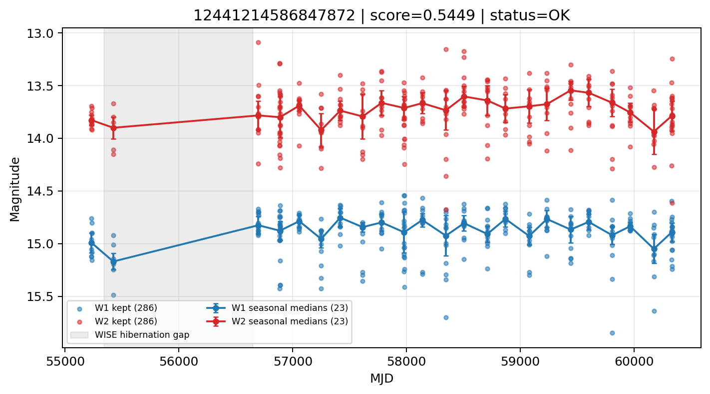

# Candidate Card: 12441214586847872 (Rank 52)

## Basic Metadata

- `source_id`: `12441214586847872`
- `canonical_id`: `12441214586847872`
- `score`: `0.544854`
- `status`: `OK`
- `final_label`: `Rejected`
- `stage_a_positive`: `True`
- `gate_blazar_veto`: `True`
- `gate_wise_qc_pass`: `True`
- `gate_data_sufficient`: `True`
- `decision_trace`: `stage_a_positive=pass;gate_blazar_veto=pass;gate_wise_qc_pass=pass;gate_data_sufficient=pass;gate_state_change_ratio_pass=pass;gate_transient_spike_pass=pass`

## Sampling / Variability Summary

- `n_points` (results table): `121.0`
- `baseline_days`: `5099.06`
- `baseline_years`: `13.960`
- `band_coverage`: `W1,W2`
- `delta_mag`: `0.285`
- `delta_mag_method`: `seasonal_median_flux`

## Coordinates

- `ra`: `52.270404`
- `dec`: `9.003607`
- `coordinate_source`: `benchmark_master`

## WISE Light Curve

## WISE QA / Rejection Accounting

| Metric | Value |
| --- | --- |
| Raw points total | 572 |
| Raw points W1 | 286 |
| Raw points W2 | 286 |
| Kept points total | 572 |
| Kept points W1 | 286 |
| Kept points W2 | 286 |
| Fraction rejected | 0 |
| Reject: missing time | 0 |
| Reject: missing mag | 0 |
| Reject: invalid band | 0 |
| Reject: cc_flags | 0 |
| Reject: qual_frame | 0 |
| Reject: moon_lev | 0 |

### QA Reject Reason Counts

| reject_reason | count |
| --- | --- |
| reject_cc_flags | 0 |
| reject_invalid_band | 0 |
| reject_missing_mag | 0 |
| reject_missing_time | 0 |
| reject_moon_lev | 0 |
| reject_qual_frame | 0 |

## Flag Summary

### `cc_flags`

| value | count | fraction |
| --- | --- | --- |
| 0000 | 572 | 1 |

### `qual_frame`

| value | count | fraction |
| --- | --- | --- |
| <NA> | 572 | 1 |

### `moon_lev`

| value | count | fraction |
| --- | --- | --- |
| 00 | 462 | 0.807692 |
| 11 | 40 | 0.0699301 |
| 0000 | 36 | 0.0629371 |
| 01 | 34 | 0.0594406 |

### `qi_fact`

| value | count | fraction |
| --- | --- | --- |
| 1.0 | 292 | 0.51049 |
| 0.5 | 144 | 0.251748 |
| 0.0 | 136 | 0.237762 |

### `saa_sep`

| value | count | fraction |
| --- | --- | --- |
| 40.625 | 4 | 0.00699301 |
| 17.3700008392334 | 4 | 0.00699301 |
| 24.0 | 4 | 0.00699301 |
| 18.538999557495117 | 4 | 0.00699301 |
| 29.0 | 2 | 0.0034965 |
| 34.04499816894531 | 2 | 0.0034965 |
| 107.61199951171875 | 2 | 0.0034965 |
| 62.446998596191406 | 2 | 0.0034965 |

### `ph_qual`

| value | count | fraction |
| --- | --- | --- |
| AB | 254 | 0.444056 |
| BB | 210 | 0.367133 |
| AA | 56 | 0.0979021 |
| <NA> | 36 | 0.0629371 |
| BA | 8 | 0.013986 |
| BC | 6 | 0.0104895 |
| BU | 2 | 0.0034965 |

## Coverage Summary

- Seasonal bins (W1): `23`
- Seasonal bins (W2): `23`
- Pre-gap coverage: `True`
- Post-gap coverage: `True`
- Both-sides coverage: `True`

## Systematics Verdict

- Verdict: `PASS`
- Summary: QA-clean points and seasonal coverage support the observed variability signal.
- QA-dominated signal check: Not obviously dominated by flagged/low-quality points

Reasons:
- Seasonal trend supported by sufficient QA-clean W1/W2 points

## Catalog Checks

- Known blazar match: `NO`
- Known CLAGN match: `NO`
- Gaia metrics: not provided / no match

## Final Label

**Rejected**

- Rank 52 with score=0.5449
- Sampling: n_points=121.0, baseline_years=13.9604782871, band_coverage=W1,W2
- QA rejection fraction=0.0% (main causes summarized in card QA section)
- Systematics verdict=PASS: QA-clean points and seasonal coverage support the observed variability signal.
- Known blazar catalog match=NO
- Dataset metadata class=star
- Rejected because dataset metadata class=star is a known contaminant class

## Reproducibility

- `run_timestamp_utc`: `2026-03-02T06:47:01.885248+00:00`
- `results_file`: `data/real_clagn/benchmark_scores_v2.csv`
- `wise_file`: `data/wise/12441214586847872.csv`
- `score_threshold`: `0.0`
- `t_recall`: `0.3493918746`
