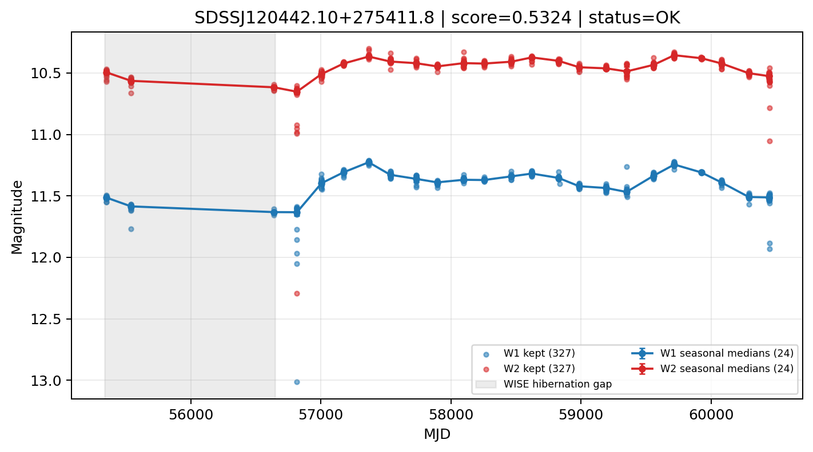

# Candidate Card: SDSSJ120442.10+275411.8 (Rank 55)

## Basic Metadata

- `source_id`: `SDSSJJ120442.10+275411.8`
- `canonical_id`: `SDSSJ120442.10+275411.8`
- `source_id_normalized`: `SDSSJ120442.10+275411.8`
- `score`: `0.532377`
- `status`: `OK`
- `final_label`: `Known AGN`
- `stage_a_positive`: `True`
- `gate_blazar_veto`: `True`
- `gate_wise_qc_pass`: `True`
- `gate_data_sufficient`: `True`
- `decision_trace`: `stage_a_positive=pass;gate_blazar_veto=pass;gate_wise_qc_pass=pass;gate_data_sufficient=pass;gate_state_change_ratio_pass=pass;gate_transient_spike_pass=pass`

## Sampling / Variability Summary

- `n_points` (results table): `74.0`
- `baseline_days`: `5097.74`
- `baseline_years`: `13.957`
- `band_coverage`: `W1,W2`
- `delta_mag`: `0.111`
- `delta_mag_method`: `seasonal_median_flux`

## Coordinates

- `ra`: `181.175450`
- `dec`: `27.903284`
- `coordinate_source`: `benchmark_master`

## WISE Light Curve

## WISE QA / Rejection Accounting

| Metric | Value |
| --- | --- |
| Raw points total | 654 |
| Raw points W1 | 327 |
| Raw points W2 | 327 |
| Kept points total | 654 |
| Kept points W1 | 327 |
| Kept points W2 | 327 |
| Fraction rejected | 0 |
| Reject: missing time | 0 |
| Reject: missing mag | 0 |
| Reject: invalid band | 0 |
| Reject: cc_flags | 0 |
| Reject: qual_frame | 0 |
| Reject: moon_lev | 0 |

### QA Reject Reason Counts

| reject_reason | count |
| --- | --- |
| reject_cc_flags | 0 |
| reject_invalid_band | 0 |
| reject_missing_mag | 0 |
| reject_missing_time | 0 |
| reject_moon_lev | 0 |
| reject_qual_frame | 0 |

## Flag Summary

### `cc_flags`

| value | count | fraction |
| --- | --- | --- |
| 0000 | 654 | 1 |

### `qual_frame`

| value | count | fraction |
| --- | --- | --- |
| <NA> | 654 | 1 |

### `moon_lev`

| value | count | fraction |
| --- | --- | --- |
| 00 | 596 | 0.911315 |
| 0000 | 50 | 0.0764526 |
| 01 | 8 | 0.0122324 |

### `qi_fact`

| value | count | fraction |
| --- | --- | --- |
| 0.5 | 466 | 0.712538 |
| 1.0 | 154 | 0.235474 |
| 0.0 | 34 | 0.0519878 |

### `saa_sep`

| value | count | fraction |
| --- | --- | --- |
| 40.0 | 6 | 0.00917431 |
| 40.53799819946289 | 4 | 0.00611621 |
| 33.020999908447266 | 4 | 0.00611621 |
| 76.0 | 4 | 0.00611621 |
| 75.0 | 4 | 0.00611621 |
| 55.0 | 2 | 0.0030581 |
| 36.28499984741211 | 2 | 0.0030581 |
| 123.89199829101562 | 2 | 0.0030581 |

### `ph_qual`

| value | count | fraction |
| --- | --- | --- |
| AA | 604 | 0.923547 |
| <NA> | 50 | 0.0764526 |

## Coverage Summary

- Seasonal bins (W1): `24`
- Seasonal bins (W2): `24`
- Pre-gap coverage: `False`
- Post-gap coverage: `True`
- Both-sides coverage: `False`

## Systematics Verdict

- Verdict: `CAUTION`
- Summary: Variability signal is present but data quality/coverage limitations weaken confidence.
- QA-dominated signal check: Not obviously dominated by flagged/low-quality points

Reasons:
- No clean coverage on both sides of WISE hibernation gap

## Catalog Checks

- Known blazar match: `NO`
- Known CLAGN match: `NO`
- Gaia metrics: not provided / no match

## Final Label

**Known AGN**

- Rank 55 with score=0.5324
- Sampling: n_points=74.0, baseline_years=13.9568487403, band_coverage=W1,W2
- QA rejection fraction=0.0% (main causes summarized in card QA section)
- Systematics verdict=CAUTION: Variability signal is present but data quality/coverage limitations weaken confidence.
- Known blazar catalog match=NO
- Dataset metadata class=clagn

## Reproducibility

- `run_timestamp_utc`: `2026-03-02T06:47:01.885248+00:00`
- `results_file`: `data/real_clagn/benchmark_scores_v2.csv`
- `wise_file`: `data/wise/SDSSJ120442.10+275411.8.csv`
- `score_threshold`: `0.0`
- `t_recall`: `0.3493918746`
