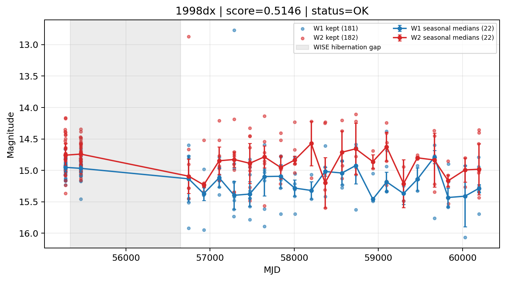

# Candidate Card: 1998dx (Rank 63)

## Basic Metadata

- `source_id`: `1998dx`
- `canonical_id`: `1998dx`
- `source_id_normalized`: `1998DX`
- `canonical_id_normalized`: `1998DX`
- `score`: `0.514583`
- `status`: `OK`
- `final_label`: `Rejected`
- `stage_a_positive`: `True`
- `gate_blazar_veto`: `True`
- `gate_wise_qc_pass`: `True`
- `gate_data_sufficient`: `True`
- `decision_trace`: `stage_a_positive=pass;gate_blazar_veto=pass;gate_wise_qc_pass=pass;gate_data_sufficient=pass;gate_state_change_ratio_pass=pass;gate_transient_spike_pass=pass`

## Sampling / Variability Summary

- `n_points` (results table): `152.0`
- `baseline_days`: `4915.03`
- `baseline_years`: `13.457`
- `band_coverage`: `W1,W2`
- `delta_mag`: `-0.354`
- `delta_mag_method`: `seasonal_median_flux`

## Coordinates

- `ra`: `272.799542`
- `dec`: `49.861306`
- `coordinate_source`: `benchmark_master`

## WISE Light Curve

## WISE QA / Rejection Accounting

| Metric | Value |
| --- | --- |
| Raw points total | 364 |
| Raw points W1 | 182 |
| Raw points W2 | 182 |
| Kept points total | 363 |
| Kept points W1 | 181 |
| Kept points W2 | 182 |
| Fraction rejected | 0.00274725 |
| Reject: missing time | 0 |
| Reject: missing mag | 1 |
| Reject: invalid band | 0 |
| Reject: cc_flags | 0 |
| Reject: qual_frame | 0 |
| Reject: moon_lev | 0 |

### QA Reject Reason Counts

| reject_reason | count |
| --- | --- |
| reject_cc_flags | 0 |
| reject_invalid_band | 0 |
| reject_missing_mag | 1 |
| reject_missing_time | 0 |
| reject_moon_lev | 0 |
| reject_qual_frame | 0 |

## Flag Summary

### `cc_flags`

| value | count | fraction |
| --- | --- | --- |
| 0000 | 364 | 1 |

### `qual_frame`

| value | count | fraction |
| --- | --- | --- |
| <NA> | 364 | 1 |

### `moon_lev`

| value | count | fraction |
| --- | --- | --- |
| 00 | 216 | 0.593407 |
| 0000 | 148 | 0.406593 |

### `qi_fact`

| value | count | fraction |
| --- | --- | --- |
| 1.0 | 330 | 0.906593 |
| 0.5 | 26 | 0.0714286 |
| 0.0 | 8 | 0.021978 |

### `saa_sep`

| value | count | fraction |
| --- | --- | --- |
| 55.0 | 12 | 0.032967 |
| 58.0 | 8 | 0.021978 |
| 97.0 | 6 | 0.0164835 |
| 127.0 | 6 | 0.0164835 |
| 78.0 | 6 | 0.0164835 |
| 124.0 | 6 | 0.0164835 |
| 82.0979995727539 | 4 | 0.010989 |
| 110.0 | 4 | 0.010989 |

### `ph_qual`

| value | count | fraction |
| --- | --- | --- |
| <NA> | 148 | 0.406593 |
| BB | 60 | 0.164835 |
| BU | 46 | 0.126374 |
| BC | 46 | 0.126374 |
| AB | 36 | 0.0989011 |
| AC | 14 | 0.0384615 |
| AU | 10 | 0.0274725 |
| BA | 2 | 0.00549451 |

## Coverage Summary

- Seasonal bins (W1): `22`
- Seasonal bins (W2): `22`
- Pre-gap coverage: `True`
- Post-gap coverage: `True`
- Both-sides coverage: `True`

## Systematics Verdict

- Verdict: `PASS`
- Summary: QA-clean points and seasonal coverage support the observed variability signal.
- QA-dominated signal check: Not obviously dominated by flagged/low-quality points

Reasons:
- Seasonal trend supported by sufficient QA-clean W1/W2 points

## Catalog Checks

- Known blazar match: `NO`
- Known CLAGN match: `NO`
- Gaia metrics: not provided / no match

## Final Label

**Rejected**

- Rank 63 with score=0.5146
- Sampling: n_points=152.0, baseline_years=13.4566285295, band_coverage=W1,W2
- QA rejection fraction=0.3% (main causes summarized in card QA section)
- Systematics verdict=PASS: QA-clean points and seasonal coverage support the observed variability signal.
- Known blazar catalog match=NO
- Dataset metadata class=sn
- Rejected because dataset metadata class=sn is a known contaminant class

## Reproducibility

- `run_timestamp_utc`: `2026-03-02T06:47:01.885248+00:00`
- `results_file`: `data/real_clagn/benchmark_scores_v2.csv`
- `wise_file`: `data/wise/1998dx.csv`
- `score_threshold`: `0.0`
- `t_recall`: `0.3493918746`
