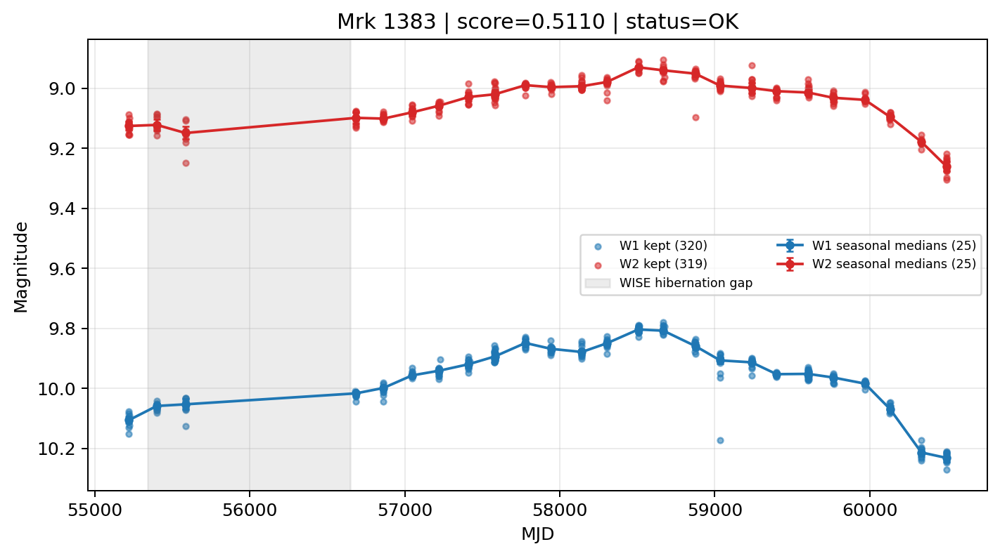

# Candidate Card: Mrk 1383 (Rank 65)

## Basic Metadata

- `source_id`: `Mrk 1383`
- `canonical_id`: `Mrk 1383`
- `source_id_normalized`: `MRK 1383`
- `canonical_id_normalized`: `MRK 1383`
- `score`: `0.510999`
- `status`: `OK`
- `final_label`: `Known blazar`
- `stage_a_positive`: `True`
- `gate_blazar_veto`: `False`
- `gate_wise_qc_pass`: `True`
- `gate_data_sufficient`: `True`
- `decision_trace`: `stage_a_positive=pass;gate_blazar_veto=fail;gate_wise_qc_pass=pass;gate_data_sufficient=pass;gate_state_change_ratio_pass=pass;gate_transient_spike_pass=pass`

## Sampling / Variability Summary

- `n_points` (results table): `207.0`
- `baseline_days`: `5274.89`
- `baseline_years`: `14.442`
- `band_coverage`: `W1,W2`
- `delta_mag`: `-0.139`
- `delta_mag_method`: `seasonal_median_flux`

## Coordinates

- `ra`: `217.277400`
- `dec`: `1.285100`
- `coordinate_source`: `benchmark_master`

## WISE Light Curve

## WISE QA / Rejection Accounting

| Metric | Value |
| --- | --- |
| Raw points total | 640 |
| Raw points W1 | 320 |
| Raw points W2 | 320 |
| Kept points total | 639 |
| Kept points W1 | 320 |
| Kept points W2 | 319 |
| Fraction rejected | 0.0015625 |
| Reject: missing time | 0 |
| Reject: missing mag | 1 |
| Reject: invalid band | 0 |
| Reject: cc_flags | 0 |
| Reject: qual_frame | 0 |
| Reject: moon_lev | 0 |

### QA Reject Reason Counts

| reject_reason | count |
| --- | --- |
| reject_cc_flags | 0 |
| reject_invalid_band | 0 |
| reject_missing_mag | 1 |
| reject_missing_time | 0 |
| reject_moon_lev | 0 |
| reject_qual_frame | 0 |

## Flag Summary

### `cc_flags`

| value | count | fraction |
| --- | --- | --- |
| 0000 | 640 | 1 |

### `qual_frame`

| value | count | fraction |
| --- | --- | --- |
| <NA> | 640 | 1 |

### `moon_lev`

| value | count | fraction |
| --- | --- | --- |
| 00 | 518 | 0.809375 |
| 0000 | 58 | 0.090625 |
| 11 | 46 | 0.071875 |
| 01 | 10 | 0.015625 |
| 0011 | 6 | 0.009375 |
| 0111 | 2 | 0.003125 |

### `qi_fact`

| value | count | fraction |
| --- | --- | --- |
| 1.0 | 514 | 0.803125 |
| 0.5 | 122 | 0.190625 |
| 0.0 | 4 | 0.00625 |

### `saa_sep`

| value | count | fraction |
| --- | --- | --- |
| 101.0 | 4 | 0.00625 |
| 23.118000030517578 | 4 | 0.00625 |
| 30.0 | 4 | 0.00625 |
| 15.0 | 4 | 0.00625 |
| 62.0 | 2 | 0.003125 |
| 22.486000061035156 | 2 | 0.003125 |
| 110.83300018310547 | 2 | 0.003125 |
| 113.08000183105469 | 2 | 0.003125 |

### `ph_qual`

| value | count | fraction |
| --- | --- | --- |
| AA | 574 | 0.896875 |
| <NA> | 66 | 0.103125 |

## Coverage Summary

- Seasonal bins (W1): `25`
- Seasonal bins (W2): `25`
- Pre-gap coverage: `True`
- Post-gap coverage: `True`
- Both-sides coverage: `True`

## Systematics Verdict

- Verdict: `PASS`
- Summary: QA-clean points and seasonal coverage support the observed variability signal.
- QA-dominated signal check: Not obviously dominated by flagged/low-quality points

Reasons:
- Seasonal trend supported by sufficient QA-clean W1/W2 points

## Catalog Checks

- Known blazar match: `YES` via `source_id` token `MRK 1383`
- Known CLAGN match: `NO`
- Gaia metrics: not provided / no match

## Final Label

**Known blazar**

- Rank 65 with score=0.5110
- Sampling: n_points=207.0, baseline_years=14.4418605397, band_coverage=W1,W2
- QA rejection fraction=0.2% (main causes summarized in card QA section)
- Systematics verdict=PASS: QA-clean points and seasonal coverage support the observed variability signal.
- Known blazar catalog match=YES
- Dataset metadata class=blazar

## Reproducibility

- `run_timestamp_utc`: `2026-03-02T06:47:01.885248+00:00`
- `results_file`: `data/real_clagn/benchmark_scores_v2.csv`
- `wise_file`: `data/wise/Mrk 1383.csv`
- `score_threshold`: `0.0`
- `t_recall`: `0.3493918746`
