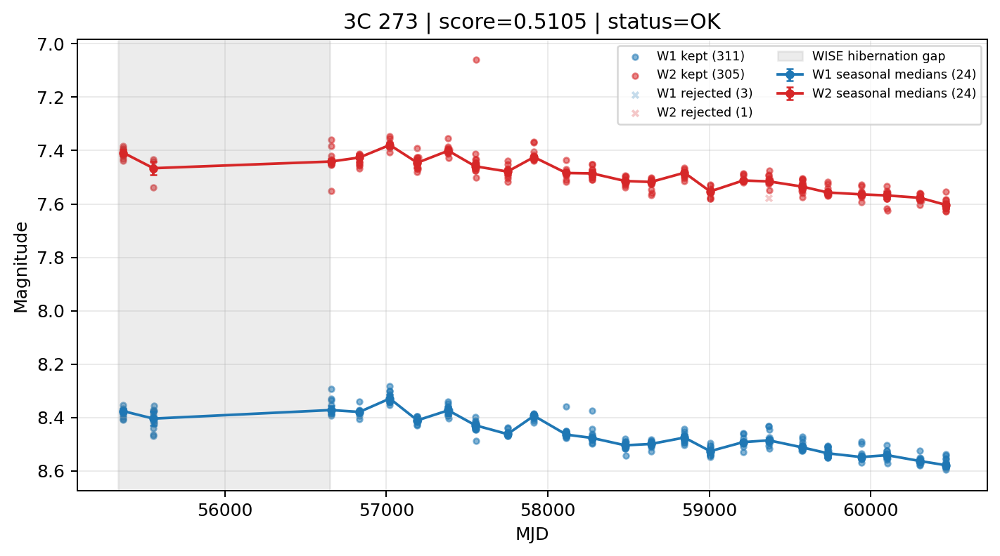

# Candidate Card: 3C 273 (Rank 67)

## Basic Metadata

- `source_id`: `3C 273`
- `canonical_id`: `3C 273`
- `score`: `0.510503`
- `status`: `OK`
- `final_label`: `Known blazar`
- `stage_a_positive`: `True`
- `gate_blazar_veto`: `False`
- `gate_wise_qc_pass`: `True`
- `gate_data_sufficient`: `True`
- `decision_trace`: `stage_a_positive=pass;gate_blazar_veto=fail;gate_wise_qc_pass=pass;gate_data_sufficient=pass;gate_state_change_ratio_pass=pass;gate_transient_spike_pass=pass`

## Sampling / Variability Summary

- `n_points` (results table): `233.0`
- `baseline_days`: `5095.68`
- `baseline_years`: `13.951`
- `band_coverage`: `W1,W2`
- `delta_mag`: `-0.184`
- `delta_mag_method`: `seasonal_median_flux`

## Coordinates

- `ra`: `187.277900`
- `dec`: `2.052400`
- `coordinate_source`: `benchmark_master`

## WISE Light Curve

## WISE QA / Rejection Accounting

| Metric | Value |
| --- | --- |
| Raw points total | 628 |
| Raw points W1 | 314 |
| Raw points W2 | 314 |
| Kept points total | 616 |
| Kept points W1 | 311 |
| Kept points W2 | 305 |
| Fraction rejected | 0.0191083 |
| Reject: missing time | 0 |
| Reject: missing mag | 8 |
| Reject: invalid band | 0 |
| Reject: cc_flags | 4 |
| Reject: qual_frame | 0 |
| Reject: moon_lev | 0 |

### QA Reject Reason Counts

| reject_reason | count |
| --- | --- |
| reject_cc_flags | 4 |
| reject_invalid_band | 0 |
| reject_missing_mag | 8 |
| reject_missing_time | 0 |
| reject_moon_lev | 0 |
| reject_qual_frame | 0 |

## Flag Summary

### `cc_flags`

| value | count | fraction |
| --- | --- | --- |
| 0000 | 622 | 0.990446 |
| g000 | 4 | 0.00636943 |
| dd00 | 2 | 0.00318471 |

### `qual_frame`

| value | count | fraction |
| --- | --- | --- |
| <NA> | 628 | 1 |

### `moon_lev`

| value | count | fraction |
| --- | --- | --- |
| 00 | 518 | 0.824841 |
| 11 | 54 | 0.0859873 |
| 0000 | 28 | 0.044586 |
| 0111 | 16 | 0.0254777 |
| 01 | 8 | 0.0127389 |
| 0011 | 4 | 0.00636943 |

### `qi_fact`

| value | count | fraction |
| --- | --- | --- |
| 1.0 | 578 | 0.920382 |
| 0.5 | 48 | 0.0764331 |
| 0.0 | 2 | 0.00318471 |

### `saa_sep`

| value | count | fraction |
| --- | --- | --- |
| 64.0 | 4 | 0.00636943 |
| 34.0 | 2 | 0.00318471 |
| 107.52300262451172 | 2 | 0.00318471 |
| 55.29100036621094 | 2 | 0.00318471 |
| 20.945999145507812 | 2 | 0.00318471 |
| 7.058000087738037 | 2 | 0.00318471 |
| 21.084999084472656 | 2 | 0.00318471 |
| 35.74800109863281 | 2 | 0.00318471 |

### `ph_qual`

| value | count | fraction |
| --- | --- | --- |
| AA | 580 | 0.923567 |
| <NA> | 48 | 0.0764331 |

## Coverage Summary

- Seasonal bins (W1): `24`
- Seasonal bins (W2): `24`
- Pre-gap coverage: `False`
- Post-gap coverage: `True`
- Both-sides coverage: `False`

## Systematics Verdict

- Verdict: `CAUTION`
- Summary: Variability signal is present but data quality/coverage limitations weaken confidence.
- QA-dominated signal check: Not obviously dominated by flagged/low-quality points

Reasons:
- No clean coverage on both sides of WISE hibernation gap

## Catalog Checks

- Known blazar match: `YES` via `source_id` token `3C 273`
- Known CLAGN match: `NO`
- Gaia metrics: not provided / no match

## Final Label

**Known blazar**

- Rank 67 with score=0.5105
- Sampling: n_points=233.0, baseline_years=13.9512090232, band_coverage=W1,W2
- QA rejection fraction=1.9% (main causes summarized in card QA section)
- Systematics verdict=CAUTION: Variability signal is present but data quality/coverage limitations weaken confidence.
- Known blazar catalog match=YES
- Dataset metadata class=blazar

## Reproducibility

- `run_timestamp_utc`: `2026-03-02T06:47:01.885248+00:00`
- `results_file`: `data/real_clagn/benchmark_scores_v2.csv`
- `wise_file`: `data/wise/3C 273.csv`
- `score_threshold`: `0.0`
- `t_recall`: `0.3493918746`
