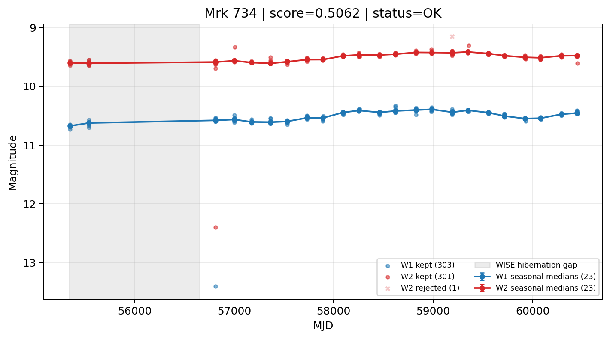

# Candidate Card: Mrk 734 (Rank 69)

## Basic Metadata

- `source_id`: `Mrk 734`
- `canonical_id`: `Mrk 734`
- `source_id_normalized`: `MRK 734`
- `canonical_id_normalized`: `MRK 734`
- `score`: `0.506189`
- `status`: `OK`
- `final_label`: `Known blazar`
- `stage_a_positive`: `True`
- `gate_blazar_veto`: `False`
- `gate_wise_qc_pass`: `True`
- `gate_data_sufficient`: `True`
- `decision_trace`: `stage_a_positive=pass;gate_blazar_veto=fail;gate_wise_qc_pass=pass;gate_data_sufficient=pass;gate_state_change_ratio_pass=pass;gate_transient_spike_pass=pass`

## Sampling / Variability Summary

- `n_points` (results table): `223.0`
- `baseline_days`: `5095.45`
- `baseline_years`: `13.951`
- `band_coverage`: `W1,W2`
- `delta_mag`: `0.181`
- `delta_mag_method`: `seasonal_median_flux`

## Coordinates

- `ra`: `170.446300`
- `dec`: `11.738400`
- `coordinate_source`: `benchmark_master`

## WISE Light Curve

## WISE QA / Rejection Accounting

| Metric | Value |
| --- | --- |
| Raw points total | 606 |
| Raw points W1 | 303 |
| Raw points W2 | 303 |
| Kept points total | 604 |
| Kept points W1 | 303 |
| Kept points W2 | 301 |
| Fraction rejected | 0.00330033 |
| Reject: missing time | 0 |
| Reject: missing mag | 1 |
| Reject: invalid band | 0 |
| Reject: cc_flags | 1 |
| Reject: qual_frame | 0 |
| Reject: moon_lev | 0 |

### QA Reject Reason Counts

| reject_reason | count |
| --- | --- |
| reject_cc_flags | 1 |
| reject_invalid_band | 0 |
| reject_missing_mag | 1 |
| reject_missing_time | 0 |
| reject_moon_lev | 0 |
| reject_qual_frame | 0 |

## Flag Summary

### `cc_flags`

| value | count | fraction |
| --- | --- | --- |
| 0000 | 604 | 0.9967 |
| 0d00 | 2 | 0.00330033 |

### `qual_frame`

| value | count | fraction |
| --- | --- | --- |
| <NA> | 606 | 1 |

### `moon_lev`

| value | count | fraction |
| --- | --- | --- |
| 00 | 490 | 0.808581 |
| 11 | 62 | 0.10231 |
| 0000 | 44 | 0.0726073 |
| 01 | 10 | 0.0165017 |

### `qi_fact`

| value | count | fraction |
| --- | --- | --- |
| 1.0 | 532 | 0.877888 |
| 0.5 | 72 | 0.118812 |
| 0.0 | 2 | 0.00330033 |

### `saa_sep`

| value | count | fraction |
| --- | --- | --- |
| 76.0 | 4 | 0.00660066 |
| 41.0 | 4 | 0.00660066 |
| 13.402999877929688 | 2 | 0.00330033 |
| 14.045000076293945 | 2 | 0.00330033 |
| 23.0049991607666 | 2 | 0.00330033 |
| 77.74099731445312 | 2 | 0.00330033 |
| 38.3129997253418 | 2 | 0.00330033 |
| 68.39800262451172 | 2 | 0.00330033 |

### `ph_qual`

| value | count | fraction |
| --- | --- | --- |
| AA | 560 | 0.924092 |
| <NA> | 44 | 0.0726073 |
| AX | 2 | 0.00330033 |

## Coverage Summary

- Seasonal bins (W1): `23`
- Seasonal bins (W2): `23`
- Pre-gap coverage: `False`
- Post-gap coverage: `True`
- Both-sides coverage: `False`

## Systematics Verdict

- Verdict: `CAUTION`
- Summary: Variability signal is present but data quality/coverage limitations weaken confidence.
- QA-dominated signal check: Not obviously dominated by flagged/low-quality points

Reasons:
- No clean coverage on both sides of WISE hibernation gap

## Catalog Checks

- Known blazar match: `YES` via `source_id` token `MRK 734`
- Known CLAGN match: `NO`
- Gaia metrics: not provided / no match

## Final Label

**Known blazar**

- Rank 69 with score=0.5062
- Sampling: n_points=223.0, baseline_years=13.9505722698, band_coverage=W1,W2
- QA rejection fraction=0.3% (main causes summarized in card QA section)
- Systematics verdict=CAUTION: Variability signal is present but data quality/coverage limitations weaken confidence.
- Known blazar catalog match=YES
- Dataset metadata class=blazar

## Reproducibility

- `run_timestamp_utc`: `2026-03-02T06:47:01.885248+00:00`
- `results_file`: `data/real_clagn/benchmark_scores_v2.csv`
- `wise_file`: `data/wise/Mrk 734.csv`
- `score_threshold`: `0.0`
- `t_recall`: `0.3493918746`
