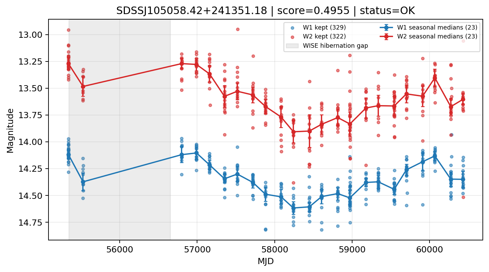

# Candidate Card: SDSSJ105058.42+241351.18 (Rank 70)

## Basic Metadata

- `source_id`: `SDSSJJ105058.42+241351.18`
- `canonical_id`: `SDSSJ105058.42+241351.18`
- `source_id_normalized`: `SDSSJ105058.42+241351.18`
- `score`: `0.495477`
- `status`: `OK`
- `final_label`: `Known AGN`
- `stage_a_positive`: `True`
- `gate_blazar_veto`: `True`
- `gate_wise_qc_pass`: `True`
- `gate_data_sufficient`: `True`
- `decision_trace`: `stage_a_positive=pass;gate_blazar_veto=pass;gate_wise_qc_pass=pass;gate_data_sufficient=pass;gate_state_change_ratio_pass=pass;gate_transient_spike_pass=pass`

## Sampling / Variability Summary

- `n_points` (results table): `240.0`
- `baseline_days`: `5098.04`
- `baseline_years`: `13.958`
- `band_coverage`: `W1,W2`
- `delta_mag`: `-0.136`
- `delta_mag_method`: `seasonal_median_flux`

## Coordinates

- `ra`: `162.743440`
- `dec`: `24.230870`
- `coordinate_source`: `benchmark_master`

## WISE Light Curve

## WISE QA / Rejection Accounting

| Metric | Value |
| --- | --- |
| Raw points total | 658 |
| Raw points W1 | 329 |
| Raw points W2 | 329 |
| Kept points total | 651 |
| Kept points W1 | 329 |
| Kept points W2 | 322 |
| Fraction rejected | 0.0106383 |
| Reject: missing time | 0 |
| Reject: missing mag | 7 |
| Reject: invalid band | 0 |
| Reject: cc_flags | 0 |
| Reject: qual_frame | 0 |
| Reject: moon_lev | 0 |

### QA Reject Reason Counts

| reject_reason | count |
| --- | --- |
| reject_cc_flags | 0 |
| reject_invalid_band | 0 |
| reject_missing_mag | 7 |
| reject_missing_time | 0 |
| reject_moon_lev | 0 |
| reject_qual_frame | 0 |

## Flag Summary

### `cc_flags`

| value | count | fraction |
| --- | --- | --- |
| 0000 | 658 | 1 |

### `qual_frame`

| value | count | fraction |
| --- | --- | --- |
| <NA> | 658 | 1 |

### `moon_lev`

| value | count | fraction |
| --- | --- | --- |
| 00 | 514 | 0.781155 |
| 11 | 44 | 0.0668693 |
| 0000 | 38 | 0.0577508 |
| 0011 | 28 | 0.0425532 |
| 01 | 22 | 0.0334347 |
| 0111 | 12 | 0.0182371 |

### `qi_fact`

| value | count | fraction |
| --- | --- | --- |
| 1.0 | 528 | 0.802432 |
| 0.5 | 128 | 0.194529 |
| 0.0 | 2 | 0.00303951 |

### `saa_sep`

| value | count | fraction |
| --- | --- | --- |
| 37.0 | 6 | 0.00911854 |
| 109.0 | 4 | 0.00607903 |
| 114.0 | 4 | 0.00607903 |
| 112.0 | 4 | 0.00607903 |
| 38.0 | 4 | 0.00607903 |
| 58.0 | 4 | 0.00607903 |
| 60.0 | 4 | 0.00607903 |
| 74.0 | 4 | 0.00607903 |

### `ph_qual`

| value | count | fraction |
| --- | --- | --- |
| AB | 380 | 0.577508 |
| AA | 174 | 0.264438 |
| <NA> | 78 | 0.118541 |
| BB | 20 | 0.0303951 |
| AX | 4 | 0.00607903 |
| AU | 2 | 0.00303951 |

## Coverage Summary

- Seasonal bins (W1): `23`
- Seasonal bins (W2): `23`
- Pre-gap coverage: `True`
- Post-gap coverage: `True`
- Both-sides coverage: `True`

## Systematics Verdict

- Verdict: `PASS`
- Summary: QA-clean points and seasonal coverage support the observed variability signal.
- QA-dominated signal check: Not obviously dominated by flagged/low-quality points

Reasons:
- Seasonal trend supported by sufficient QA-clean W1/W2 points

## Catalog Checks

- Known blazar match: `NO`
- Known CLAGN match: `YES` (method=coordinate)
- Gaia metrics: not provided / no match

## Final Label

**Known AGN**

- Rank 70 with score=0.4955
- Sampling: n_points=240.0, baseline_years=13.9576787146, band_coverage=W1,W2
- QA rejection fraction=1.1% (main causes summarized in card QA section)
- Systematics verdict=PASS: QA-clean points and seasonal coverage support the observed variability signal.
- Known blazar catalog match=NO
- Dataset metadata class=clagn
- Known CLAGN file match=YES

## Reproducibility

- `run_timestamp_utc`: `2026-03-02T06:47:01.885248+00:00`
- `results_file`: `data/real_clagn/benchmark_scores_v2.csv`
- `wise_file`: `data/wise/SDSSJ105058.42+241351.18.csv`
- `score_threshold`: `0.0`
- `t_recall`: `0.3493918746`
