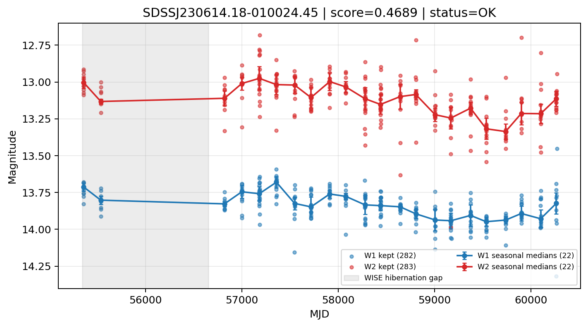

# Candidate Card: SDSSJ230614.18-010024.45 (Rank 77)

## Basic Metadata

- `source_id`: `SDSSJJ230614.18-010024.45`
- `canonical_id`: `SDSSJ230614.18-010024.45`
- `source_id_normalized`: `SDSSJ230614.18-010024.45`
- `score`: `0.468945`
- `status`: `OK`
- `final_label`: `Known AGN`
- `stage_a_positive`: `True`
- `gate_blazar_veto`: `True`
- `gate_wise_qc_pass`: `True`
- `gate_data_sufficient`: `True`
- `decision_trace`: `stage_a_positive=pass;gate_blazar_veto=pass;gate_wise_qc_pass=pass;gate_data_sufficient=pass;gate_state_change_ratio_pass=pass;gate_transient_spike_pass=pass`

## Sampling / Variability Summary

- `n_points` (results table): `217.0`
- `baseline_days`: `4909.94`
- `baseline_years`: `13.443`
- `band_coverage`: `W1,W2`
- `delta_mag`: `-0.135`
- `delta_mag_method`: `seasonal_median_flux`

## Coordinates

- `ra`: `346.559090`
- `dec`: `-1.006800`
- `coordinate_source`: `benchmark_master`

## WISE Light Curve

## WISE QA / Rejection Accounting

| Metric | Value |
| --- | --- |
| Raw points total | 566 |
| Raw points W1 | 283 |
| Raw points W2 | 283 |
| Kept points total | 565 |
| Kept points W1 | 282 |
| Kept points W2 | 283 |
| Fraction rejected | 0.00176678 |
| Reject: missing time | 0 |
| Reject: missing mag | 1 |
| Reject: invalid band | 0 |
| Reject: cc_flags | 0 |
| Reject: qual_frame | 0 |
| Reject: moon_lev | 0 |

### QA Reject Reason Counts

| reject_reason | count |
| --- | --- |
| reject_cc_flags | 0 |
| reject_invalid_band | 0 |
| reject_missing_mag | 1 |
| reject_missing_time | 0 |
| reject_moon_lev | 0 |
| reject_qual_frame | 0 |

## Flag Summary

### `cc_flags`

| value | count | fraction |
| --- | --- | --- |
| 0000 | 566 | 1 |

### `qual_frame`

| value | count | fraction |
| --- | --- | --- |
| <NA> | 566 | 1 |

### `moon_lev`

| value | count | fraction |
| --- | --- | --- |
| 00 | 464 | 0.819788 |
| 0000 | 46 | 0.0812721 |
| 11 | 44 | 0.0777385 |
| 01 | 12 | 0.0212014 |

### `qi_fact`

| value | count | fraction |
| --- | --- | --- |
| 1.0 | 510 | 0.90106 |
| 0.5 | 48 | 0.0848057 |
| 0.0 | 8 | 0.0141343 |

### `saa_sep`

| value | count | fraction |
| --- | --- | --- |
| 11.140000343322754 | 4 | 0.00706714 |
| 13.0 | 4 | 0.00706714 |
| 52.0 | 4 | 0.00706714 |
| 4.0 | 4 | 0.00706714 |
| 21.0 | 4 | 0.00706714 |
| 16.19300079345703 | 2 | 0.00353357 |
| 15.508000373840332 | 2 | 0.00353357 |
| 33.178001403808594 | 2 | 0.00353357 |

### `ph_qual`

| value | count | fraction |
| --- | --- | --- |
| AA | 408 | 0.720848 |
| AB | 106 | 0.187279 |
| <NA> | 46 | 0.0812721 |
| AC | 2 | 0.00353357 |
| BA | 2 | 0.00353357 |
| XB | 2 | 0.00353357 |

## Coverage Summary

- Seasonal bins (W1): `22`
- Seasonal bins (W2): `22`
- Pre-gap coverage: `False`
- Post-gap coverage: `True`
- Both-sides coverage: `False`

## Systematics Verdict

- Verdict: `CAUTION`
- Summary: Variability signal is present but data quality/coverage limitations weaken confidence.
- QA-dominated signal check: Not obviously dominated by flagged/low-quality points

Reasons:
- No clean coverage on both sides of WISE hibernation gap

## Catalog Checks

- Known blazar match: `NO`
- Known CLAGN match: `NO`
- Gaia metrics: not provided / no match

## Final Label

**Known AGN**

- Rank 77 with score=0.4689
- Sampling: n_points=217.0, baseline_years=13.4426700657, band_coverage=W1,W2
- QA rejection fraction=0.2% (main causes summarized in card QA section)
- Systematics verdict=CAUTION: Variability signal is present but data quality/coverage limitations weaken confidence.
- Known blazar catalog match=NO
- Dataset metadata class=clagn

## Reproducibility

- `run_timestamp_utc`: `2026-03-02T06:47:01.885248+00:00`
- `results_file`: `data/real_clagn/benchmark_scores_v2.csv`
- `wise_file`: `data/wise/SDSSJ230614.18-010024.45.csv`
- `score_threshold`: `0.0`
- `t_recall`: `0.3493918746`
