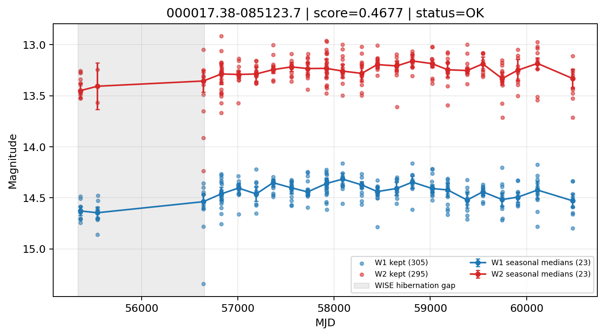

# Candidate Card: 000017.38-085123.7 (Rank 78)

## Basic Metadata

- `source_id`: `000017.38-085123.7`
- `canonical_id`: `000017.38-085123.7`
- `score`: `0.467673`
- `status`: `OK`
- `final_label`: `Known AGN`
- `stage_a_positive`: `True`
- `gate_blazar_veto`: `True`
- `gate_wise_qc_pass`: `True`
- `gate_data_sufficient`: `True`
- `decision_trace`: `stage_a_positive=pass;gate_blazar_veto=pass;gate_wise_qc_pass=pass;gate_data_sufficient=pass;gate_state_change_ratio_pass=pass;gate_transient_spike_pass=pass`

## Sampling / Variability Summary

- `n_points` (results table): `165.0`
- `baseline_days`: `5114.02`
- `baseline_years`: `14.001`
- `band_coverage`: `W1,W2`
- `delta_mag`: `0.157`
- `delta_mag_method`: `seasonal_median_flux`

## Coordinates

- `ra`: `0.072423`
- `dec`: `-8.856608`
- `coordinate_source`: `benchmark_master`

## WISE Light Curve

## WISE QA / Rejection Accounting

| Metric | Value |
| --- | --- |
| Raw points total | 610 |
| Raw points W1 | 305 |
| Raw points W2 | 305 |
| Kept points total | 600 |
| Kept points W1 | 305 |
| Kept points W2 | 295 |
| Fraction rejected | 0.0163934 |
| Reject: missing time | 0 |
| Reject: missing mag | 10 |
| Reject: invalid band | 0 |
| Reject: cc_flags | 0 |
| Reject: qual_frame | 0 |
| Reject: moon_lev | 0 |

### QA Reject Reason Counts

| reject_reason | count |
| --- | --- |
| reject_cc_flags | 0 |
| reject_invalid_band | 0 |
| reject_missing_mag | 10 |
| reject_missing_time | 0 |
| reject_moon_lev | 0 |
| reject_qual_frame | 0 |

## Flag Summary

### `cc_flags`

| value | count | fraction |
| --- | --- | --- |
| 0000 | 610 | 1 |

### `qual_frame`

| value | count | fraction |
| --- | --- | --- |
| <NA> | 610 | 1 |

### `moon_lev`

| value | count | fraction |
| --- | --- | --- |
| 00 | 506 | 0.829508 |
| 11 | 42 | 0.0688525 |
| 0000 | 28 | 0.0459016 |
| 0111 | 18 | 0.0295082 |
| 01 | 14 | 0.0229508 |
| 0011 | 2 | 0.00327869 |

### `qi_fact`

| value | count | fraction |
| --- | --- | --- |
| 1.0 | 416 | 0.681967 |
| 0.5 | 180 | 0.295082 |
| 0.0 | 14 | 0.0229508 |

### `saa_sep`

| value | count | fraction |
| --- | --- | --- |
| 7.0 | 4 | 0.00655738 |
| 13.0 | 4 | 0.00655738 |
| 88.0 | 2 | 0.00327869 |
| 75.88400268554688 | 2 | 0.00327869 |
| 53.417999267578125 | 2 | 0.00327869 |
| 14.98799991607666 | 2 | 0.00327869 |
| -2.552000045776367 | 2 | 0.00327869 |
| 96.2300033569336 | 2 | 0.00327869 |

### `ph_qual`

| value | count | fraction |
| --- | --- | --- |
| AA | 388 | 0.636066 |
| AB | 148 | 0.242623 |
| <NA> | 48 | 0.0786885 |
| BB | 12 | 0.0196721 |
| BA | 10 | 0.0163934 |
| BC | 2 | 0.00327869 |
| AX | 2 | 0.00327869 |

## Coverage Summary

- Seasonal bins (W1): `23`
- Seasonal bins (W2): `23`
- Pre-gap coverage: `False`
- Post-gap coverage: `True`
- Both-sides coverage: `False`

## Systematics Verdict

- Verdict: `CAUTION`
- Summary: Variability signal is present but data quality/coverage limitations weaken confidence.
- QA-dominated signal check: Not obviously dominated by flagged/low-quality points

Reasons:
- No clean coverage on both sides of WISE hibernation gap

## Catalog Checks

- Known blazar match: `NO`
- Known CLAGN match: `NO`
- Gaia metrics: not provided / no match

## Final Label

**Known AGN**

- Rank 78 with score=0.4677
- Sampling: n_points=165.0, baseline_years=14.0014273659, band_coverage=W1,W2
- QA rejection fraction=1.6% (main causes summarized in card QA section)
- Systematics verdict=CAUTION: Variability signal is present but data quality/coverage limitations weaken confidence.
- Known blazar catalog match=NO
- Dataset metadata class=normal_agn

## Reproducibility

- `run_timestamp_utc`: `2026-03-02T06:47:01.885248+00:00`
- `results_file`: `data/real_clagn/benchmark_scores_v2.csv`
- `wise_file`: `data/wise/000017.38-085123.7.csv`
- `score_threshold`: `0.0`
- `t_recall`: `0.3493918746`
