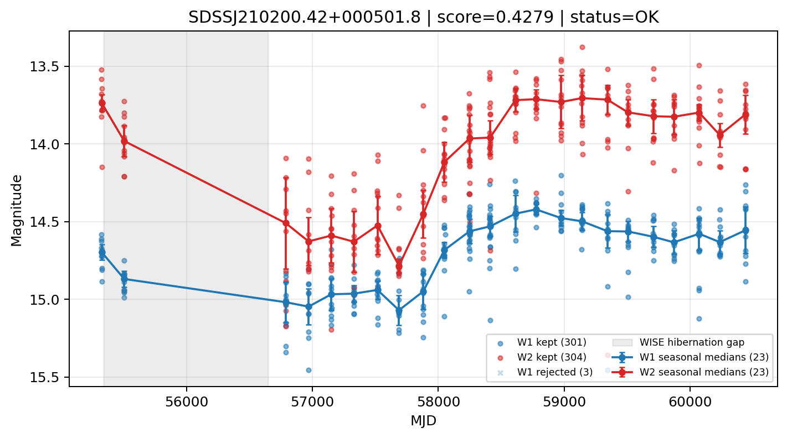

# Candidate Card: SDSSJ210200.42+000501.8 (Rank 90)

## Basic Metadata

- `source_id`: `SDSSJ210200.42+000501.8`
- `canonical_id`: `SDSSJ210200.42+000501.8`
- `score`: `0.427861`
- `status`: `OK`
- `final_label`: `Known AGN`
- `stage_a_positive`: `True`
- `gate_blazar_veto`: `True`
- `gate_wise_qc_pass`: `True`
- `gate_data_sufficient`: `True`
- `decision_trace`: `stage_a_positive=pass;gate_blazar_veto=pass;gate_wise_qc_pass=pass;gate_data_sufficient=pass;gate_state_change_ratio_pass=pass;gate_transient_spike_pass=pass`

## Sampling / Variability Summary

- `n_points` (results table): `212.0`
- `baseline_days`: `5114.26`
- `baseline_years`: `14.002`
- `band_coverage`: `W1,W2`
- `delta_mag`: `0.159`
- `delta_mag_method`: `seasonal_median_flux`

## Coordinates

- `ra`: `315.501770`
- `dec`: `0.083850`
- `coordinate_source`: `benchmark_master`

## WISE Light Curve

## WISE QA / Rejection Accounting

| Metric | Value |
| --- | --- |
| Raw points total | 608 |
| Raw points W1 | 304 |
| Raw points W2 | 304 |
| Kept points total | 605 |
| Kept points W1 | 301 |
| Kept points W2 | 304 |
| Fraction rejected | 0.00493421 |
| Reject: missing time | 0 |
| Reject: missing mag | 0 |
| Reject: invalid band | 0 |
| Reject: cc_flags | 3 |
| Reject: qual_frame | 0 |
| Reject: moon_lev | 0 |

### QA Reject Reason Counts

| reject_reason | count |
| --- | --- |
| reject_cc_flags | 3 |
| reject_invalid_band | 0 |
| reject_missing_mag | 0 |
| reject_missing_time | 0 |
| reject_moon_lev | 0 |
| reject_qual_frame | 0 |

## Flag Summary

### `cc_flags`

| value | count | fraction |
| --- | --- | --- |
| 0000 | 602 | 0.990132 |
| g000 | 6 | 0.00986842 |

### `qual_frame`

| value | count | fraction |
| --- | --- | --- |
| <NA> | 608 | 1 |

### `moon_lev`

| value | count | fraction |
| --- | --- | --- |
| 00 | 510 | 0.838816 |
| 0000 | 48 | 0.0789474 |
| 01 | 28 | 0.0460526 |
| 11 | 22 | 0.0361842 |

### `qi_fact`

| value | count | fraction |
| --- | --- | --- |
| 1.0 | 490 | 0.805921 |
| 0.5 | 98 | 0.161184 |
| 0.0 | 20 | 0.0328947 |

### `saa_sep`

| value | count | fraction |
| --- | --- | --- |
| 9.0 | 6 | 0.00986842 |
| 19.0 | 6 | 0.00986842 |
| 81.0 | 2 | 0.00328947 |
| 100.47799682617188 | 2 | 0.00328947 |
| 64.04199981689453 | 2 | 0.00328947 |
| 60.4739990234375 | 2 | 0.00328947 |
| 12.63599967956543 | 2 | 0.00328947 |
| 15.965999603271484 | 2 | 0.00328947 |

### `ph_qual`

| value | count | fraction |
| --- | --- | --- |
| AB | 406 | 0.667763 |
| BB | 88 | 0.144737 |
| <NA> | 48 | 0.0789474 |
| AC | 20 | 0.0328947 |
| AA | 16 | 0.0263158 |
| BC | 14 | 0.0230263 |
| AU | 8 | 0.0131579 |
| BU | 6 | 0.00986842 |

## Coverage Summary

- Seasonal bins (W1): `23`
- Seasonal bins (W2): `23`
- Pre-gap coverage: `True`
- Post-gap coverage: `True`
- Both-sides coverage: `True`

## Systematics Verdict

- Verdict: `PASS`
- Summary: QA-clean points and seasonal coverage support the observed variability signal.
- QA-dominated signal check: Not obviously dominated by flagged/low-quality points

Reasons:
- Seasonal trend supported by sufficient QA-clean W1/W2 points

## Catalog Checks

- Known blazar match: `NO`
- Known CLAGN match: `YES` (method=coordinate)
- Gaia metrics: not provided / no match

## Final Label

**Known AGN**

- Rank 90 with score=0.4279
- Sampling: n_points=212.0, baseline_years=14.002070018, band_coverage=W1,W2
- QA rejection fraction=0.5% (main causes summarized in card QA section)
- Systematics verdict=PASS: QA-clean points and seasonal coverage support the observed variability signal.
- Known blazar catalog match=NO
- Dataset metadata class=clagn
- Known CLAGN file match=YES

## Reproducibility

- `run_timestamp_utc`: `2026-03-02T06:47:01.885248+00:00`
- `results_file`: `data/real_clagn/benchmark_scores_v2.csv`
- `wise_file`: `data/wise/SDSSJ210200.42+000501.8.csv`
- `score_threshold`: `0.0`
- `t_recall`: `0.3493918746`
