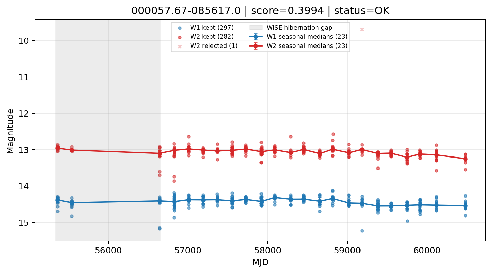

# Candidate Card: 000057.67-085617.0 (Rank 96)

## Basic Metadata

- `source_id`: `000057.67-085617.0`
- `canonical_id`: `000057.67-085617.0`
- `score`: `0.399395`
- `status`: `OK`
- `final_label`: `Known AGN`
- `stage_a_positive`: `True`
- `gate_blazar_veto`: `True`
- `gate_wise_qc_pass`: `True`
- `gate_data_sufficient`: `True`
- `decision_trace`: `stage_a_positive=pass;gate_blazar_veto=pass;gate_wise_qc_pass=pass;gate_data_sufficient=pass;gate_state_change_ratio_pass=pass;gate_transient_spike_pass=pass`

## Sampling / Variability Summary

- `n_points` (results table): `168.0`
- `baseline_days`: `5114.14`
- `baseline_years`: `14.002`
- `band_coverage`: `W1,W2`
- `delta_mag`: `-0.078`
- `delta_mag_method`: `seasonal_median_flux`

## Coordinates

- `ra`: `0.240324`
- `dec`: `-8.938062`
- `coordinate_source`: `benchmark_master`

## WISE Light Curve

## WISE QA / Rejection Accounting

| Metric | Value |
| --- | --- |
| Raw points total | 594 |
| Raw points W1 | 297 |
| Raw points W2 | 297 |
| Kept points total | 579 |
| Kept points W1 | 297 |
| Kept points W2 | 282 |
| Fraction rejected | 0.0252525 |
| Reject: missing time | 0 |
| Reject: missing mag | 14 |
| Reject: invalid band | 0 |
| Reject: cc_flags | 1 |
| Reject: qual_frame | 0 |
| Reject: moon_lev | 0 |

### QA Reject Reason Counts

| reject_reason | count |
| --- | --- |
| reject_cc_flags | 1 |
| reject_invalid_band | 0 |
| reject_missing_mag | 14 |
| reject_missing_time | 0 |
| reject_moon_lev | 0 |
| reject_qual_frame | 0 |

## Flag Summary

### `cc_flags`

| value | count | fraction |
| --- | --- | --- |
| 0000 | 592 | 0.996633 |
| 0h00 | 2 | 0.003367 |

### `qual_frame`

| value | count | fraction |
| --- | --- | --- |
| <NA> | 594 | 1 |

### `moon_lev`

| value | count | fraction |
| --- | --- | --- |
| 00 | 490 | 0.824916 |
| 11 | 40 | 0.0673401 |
| 0111 | 26 | 0.043771 |
| 0000 | 24 | 0.040404 |
| 01 | 10 | 0.016835 |
| 0011 | 4 | 0.00673401 |

### `qi_fact`

| value | count | fraction |
| --- | --- | --- |
| 1.0 | 418 | 0.703704 |
| 0.5 | 168 | 0.282828 |
| 0.0 | 8 | 0.013468 |

### `saa_sep`

| value | count | fraction |
| --- | --- | --- |
| 13.0 | 4 | 0.00673401 |
| 7.0 | 4 | 0.00673401 |
| 0.35199999809265137 | 4 | 0.00673401 |
| 48.0 | 4 | 0.00673401 |
| 88.0 | 2 | 0.003367 |
| 53.79100036621094 | 2 | 0.003367 |
| 95.15599822998047 | 2 | 0.003367 |
| 115.74500274658203 | 2 | 0.003367 |

### `ph_qual`

| value | count | fraction |
| --- | --- | --- |
| AA | 424 | 0.713805 |
| AB | 76 | 0.127946 |
| <NA> | 54 | 0.0909091 |
| BA | 20 | 0.03367 |
| BB | 18 | 0.030303 |
| AX | 2 | 0.003367 |

## Coverage Summary

- Seasonal bins (W1): `23`
- Seasonal bins (W2): `23`
- Pre-gap coverage: `False`
- Post-gap coverage: `True`
- Both-sides coverage: `False`

## Systematics Verdict

- Verdict: `CAUTION`
- Summary: Variability signal is present but data quality/coverage limitations weaken confidence.
- QA-dominated signal check: Not obviously dominated by flagged/low-quality points

Reasons:
- No clean coverage on both sides of WISE hibernation gap

## Catalog Checks

- Known blazar match: `NO`
- Known CLAGN match: `NO`
- Gaia metrics: not provided / no match

## Final Label

**Known AGN**

- Rank 96 with score=0.3994
- Sampling: n_points=168.0, baseline_years=14.0017655395, band_coverage=W1,W2
- QA rejection fraction=2.5% (main causes summarized in card QA section)
- Systematics verdict=CAUTION: Variability signal is present but data quality/coverage limitations weaken confidence.
- Known blazar catalog match=NO
- Dataset metadata class=normal_agn

## Reproducibility

- `run_timestamp_utc`: `2026-03-02T06:47:01.885248+00:00`
- `results_file`: `data/real_clagn/benchmark_scores_v2.csv`
- `wise_file`: `data/wise/000057.67-085617.0.csv`
- `score_threshold`: `0.0`
- `t_recall`: `0.3493918746`
